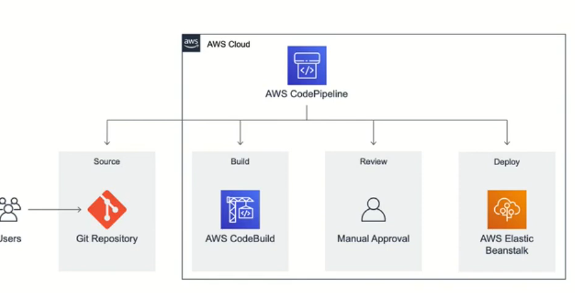
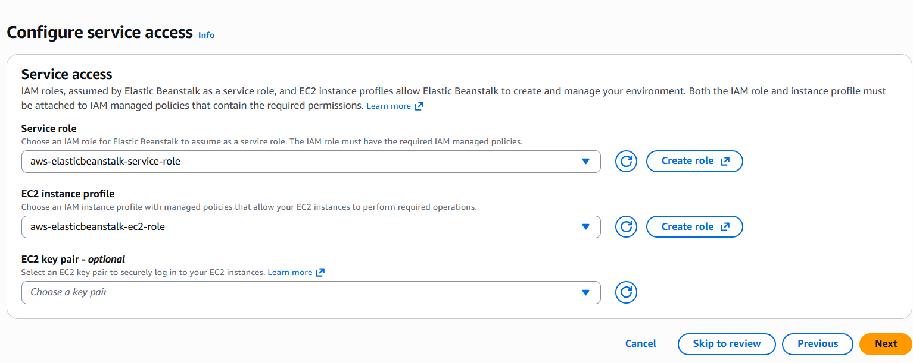
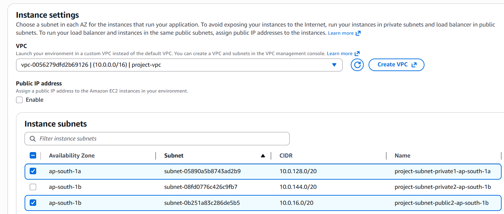
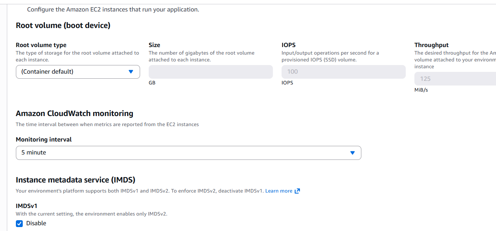
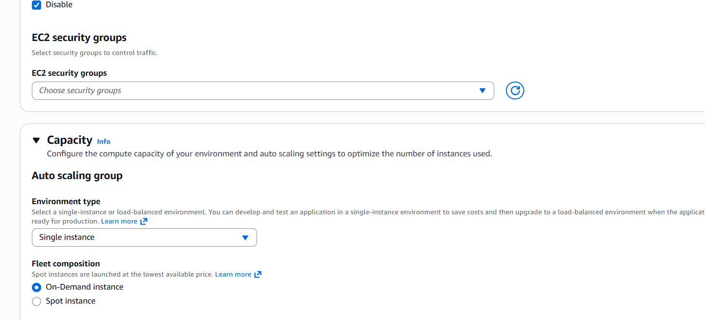
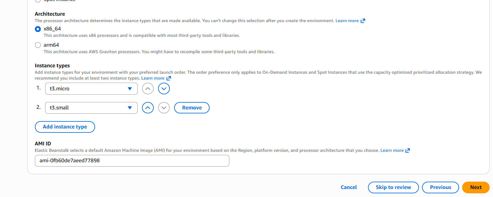

https://github.com/aws-samples/aws-elastic-beanstalk-express-js-sample

https://github.com/geethasamynathan/aws-elastic-beanstalk-express-js-sample

- Goto aws console
- Amazon Elastic Beanstalk
- Create application
- ApplicationName :DevopsGettingStarted
- Environament:DevopsGettingStarted-env
- Platform :noed.js
- Application Code: sample application
- Presets :Single instance (free tier eligible)

