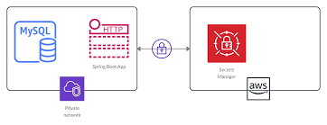
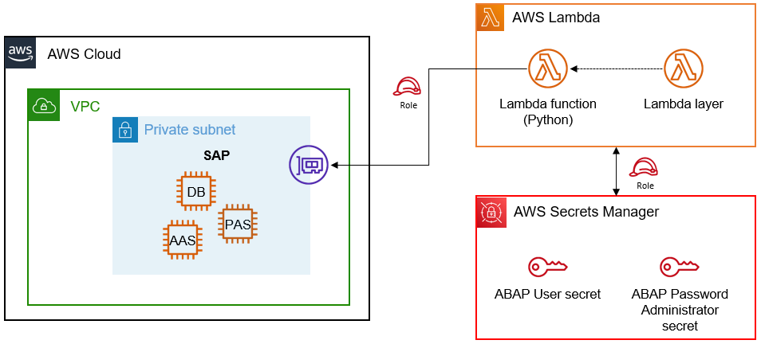

# Secrets Management Best Practices in AWS


# 🟦 1. What Are Secrets in AWS?

A secret is any sensitive value that must be protected:

Database passwords

API keys (Stripe, Razorpay, Twilio)

AWS access keys

SSH private keys

OAuth tokens

Certificates

Application configuration that should NOT be hardcoded.

# 🟧 2. WHY Secrets Management is Necessary?
**✔ Prevent hardcoding credentials**

Putting API keys or passwords in source code is dangerous.

**✔ Prevent leaking secrets in:**

- GitHub

- CloudWatch logs

- Lambda logs

- Chat apps (Slack, Teams, WhatsApp)

**✔ Centralized location**

Secrets stored in one secure location instead of being scattered.

**✔ Automated rotation**

Avoid passwords that stay unchanged for years.

**✔ Access control**

IAM-based permission model.

**✔ Auditing**

Who accessed what? When?

## 🟦 3. AWS Tools for Secrets Management
| Service                                | Purpose                         | Rotation           | Cost             |
| -------------------------------------- | ------------------------------- | ------------------ | ---------------- |
| **AWS Secrets Manager**                | Enterprise-grade secret storage | ✔ Automatic        | Paid             |
| **SSM Parameter Store (SecureString)** | General configs + basic secrets | ❌ No auto rotation | Free (Standard)  |
| **AWS KMS**                            | Encryption/decryption engine    | N/A                | Paid per request |


## 4. Secrets Manager vs Parameter Store (BEST PRACTICE CHOICE)
✔ Use **Secrets Manager** when:

You need automatic rotation

Secrets are used by databases (RDS, Aurora, Redshift)

High security systems (banking, fintech, SaaS)

✔ Use **Parameter Store** when:

Storing basic config values

Storing non-rotating secrets

You want free secret storage

## 5. How Secrets Manager Works (Architecture)





### Components:

**Secrets Manager Service** – stores encrypted secrets

**KMS key**– encrypts/decrypts

**Rotation Lambda** – rotates password for RDS/Aurora

**AWS IAM** – controls permission to read/write secrets

**CloudTrail** – logs secret access

## 🟩 6. BEST PRACTICE #1 — Never Hardcode Secrets
❌ Bad:
`db_password = "MyRealPassword123"`

✔ Good:
```python
import boto3

client = boto3.client("secretsmanager")
secret = client.get_secret_value(SecretId="prod/db/password")
password = secret["SecretString"]

```

## 🟩 7. BEST PRACTICE #2 — Enable Encryption with KMS
AWS Secrets Manager **automatically** encrypts secrets with KMS keys.

BUT BEST PRACTICE IS:

**✔ Use a customer-managed KMS key, not AWS-managed default**

You get:

Rotation control

Access policies

Cross-account access

## 🟩 8. BEST PRACTICE #3 — Enable Secret Rotation

**Rotation is CRITICAL for:**

Databases

Microservices

Fintech apps


**Secrets Manager can auto-rotate:**

RDS MySQL

RDS PostgreSQL

Aurora

Redshift

Third-party secrets (via Lambda)

**Auto-rotation flow:**

- Generate new password
- Update DB
- Validate new password
- Update Secrets Manager
- Safely switch apps
_
## 🟦 9. BEST PRACTICE #4 — Least Privilege Access

✔ Developers should NOT have direct access to secrets.

✔ Applications (Lambda, ECS, EC2) should get secrets using IAM role:
```json
Example policy:

{
 "Version": "2012-10-17",
 "Statement": [
   {
     "Effect": "Allow",
     "Action": "secretsmanager:GetSecretValue",
     "Resource": "arn:aws:secretsmanager:region:acct:secret:prod/db/*"
   }
 ]
}
```

## 🟪 10. BEST PRACTICE #5 — Use Resource Policies

Secrets Manager resource policies allow:

- ✔ Cross-account access
- ✔ Restrict access to certain VPCs/IPs
- ✔ Prevent accidental deletion
## 🟦 11. BEST PRACTICE #6 — Audit All secret access

AWS CloudTrail tracks:

- Who accessed the secret
- What IP was used
- What IAM identity
- What time

Turn on:

- ✔ CloudTrail
- ✔ CloudWatch alarms for unauthorized access
- ✔ GuardDuty anomaly detection
## 🟧 12. BEST PRACTICE #7 — Tag Secrets
Tag secrets by:
- Environment (prod/dev/test)
- Owner team (backend, data, devops)
- Application (payments, orders)
- Compliance classification (PII, secret, public)

Helps in:
- Cost management
- Governance
- Rotation grouping
- 
##  🟦 13. BEST PRACTICE #8 — Use Secret Caching (Performance)

For high traffic apps like:

- Web services
- Microservices
- API Gateways
  
AWS SDK provides:
```python
from aws_secretsmanager_caching import SecretCache

cache = SecretCache()
secret = cache.get_secret_string("my-secret")
```

**Benefit:**
 - Reduces latency
 - Saves money (less Secrets Manager API calls)

## 🟩 14. BEST PRACTICE #9 — Store Secret Version History

Secrets Manager automatically stores:

- Version v1
- Version v2
- Version v3

You can roll back if needed.

## 🟪 15. BEST PRACTICE #10 — Monitor Secret Expiry

If using rotation, set CloudWatch alerts:

- Rotation failed
- Secret version left pending
- App using old secret version
This protects production environments.

## 🟦 16. Hands-on Example: Storing + Retrieving a Secret
**Step 1: Create Secret**

AWS Console → Secrets Manager → Store a new secret

Example:
- Username: admin
- Password: Admin2025!
- Secret Name: prod/mysql/db_credentials

**Step 2: Retrieve via AWS CLI**
```sh
aws secretsmanager get-secret-value \
  --secret-id prod/mysql/db_credentials \
  --query SecretString \
  --output text
```
**Step 3: Retrieve in Lambda (Python)**

```python
import boto3, json

client = boto3.client('secretsmanager')

secret = client.get_secret_value(SecretId="prod/mysql/db_credentials")
creds = json.loads(secret["SecretString"])

print(creds["username"])
print(creds["password"])
```
**Step 4: Apply IAM permissions**
```json
{
 "Effect": "Allow",
 "Action": ["secretsmanager:GetSecretValue"],
 "Resource": "arn:aws:secretsmanager:::prod/mysql/*"
}
```

# 🟩 19. Common Mistakes (To Avoid)

- ❌ Storing secrets in GitHub
- ❌ Sharing secrets via WhatsApp or Email
- ❌ Using IAM users instead of roles
- ❌ Hardcoding secrets inside Lambda/EC2/ECS tasks
- ❌ No review of CloudTrail logs
- ❌ No secret rotation
- ❌ Using plaintext in environment variables