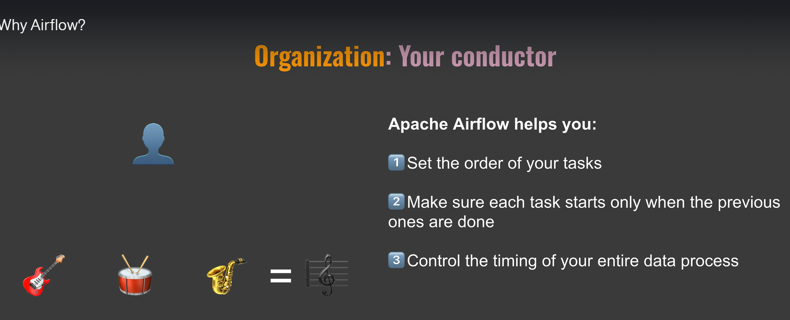
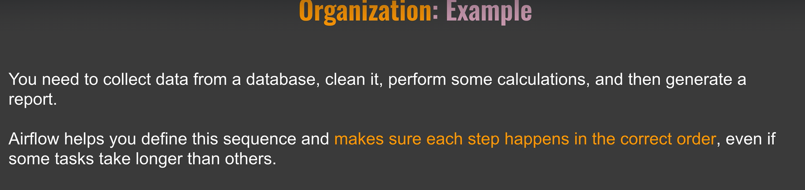
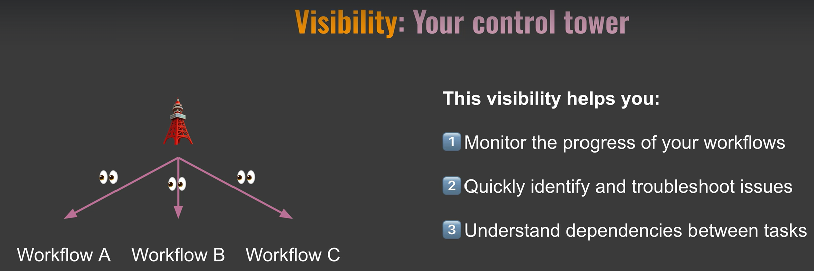
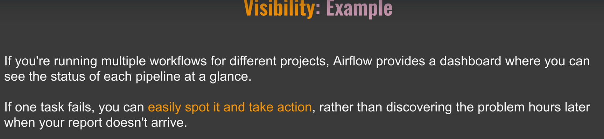
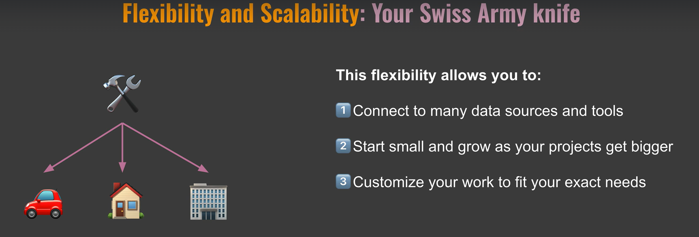
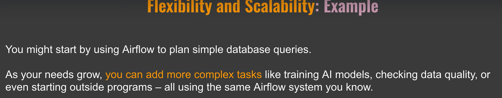

# Why Apache Airflow?

# What is Airflow?

# core components. 
- 1.meta database
- 2.Scheduler
     DAG file processor
- 3. Executor
- 4. API Server
  - It provides endpoints for task operations and serving the UI
- 5. Worker
  - worker are the processes that acutally perfomr the tasks
- 6.Queue
- The Q is a list of tasks waiting to be executed
- 7. Trigger
- The trigger Is responsible for managing deferable tasks- task that wait for external events.
- It allows air flow to efficiently handle tasks that depend on external factors without blocking other processes
    Example Imagine you are waiting for an important email before starting a task The triggerer is like your assistant who keeps an eye on your inbox and notifies you when the email arrives 11 you to focus on the work in the meantime.

# The DAG (directed Acycllic Graph)

A dag is a collection of All the tasks you want to run organised in a way that reflects their dependencies.

It helps you to define the structure of your entire workflow showing which task needs to be happened before others

Example
Think of a dog like a recipe.

Just as a recipe list all the steps to make a dish in the correct order a dag in airflow list all the tasks to complete your data workflow in the right sequence

# Operator
An operator defines a single ideally item potent task in your dag.

Operator Allows you to breakdown your workflow into discrete manageable pieces of work.

If a DAG is like a recipe operators are like individual instruction into that recipe.

Just as brake 5X into single step in a recipe extract data operator could be a single task in your DAG that pulls data from specific resource