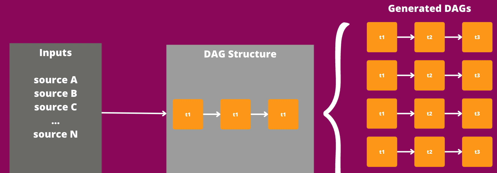
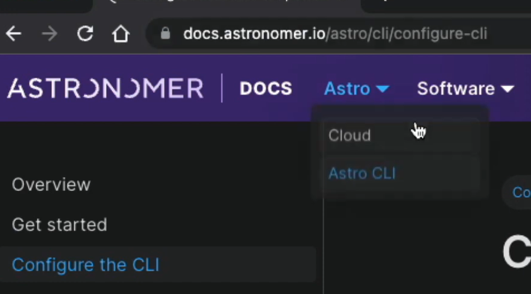
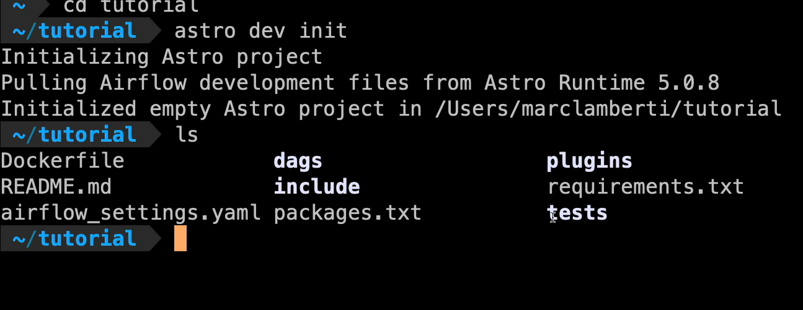
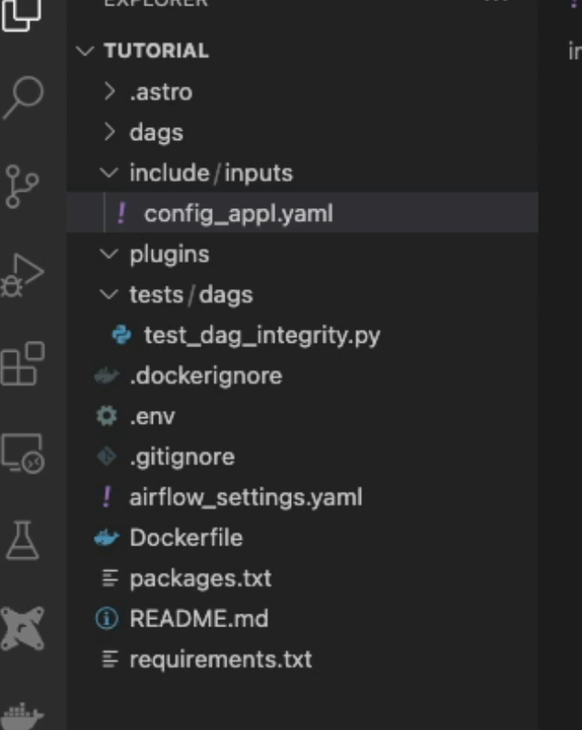
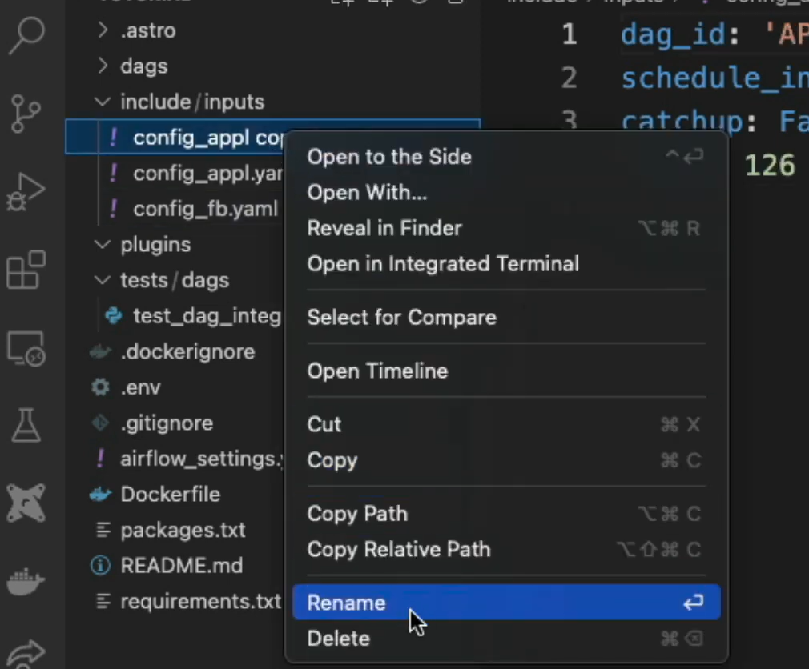
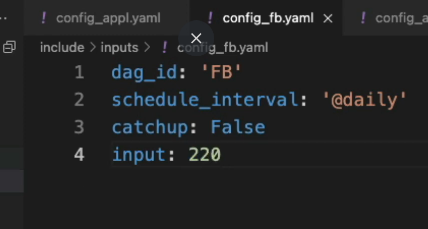
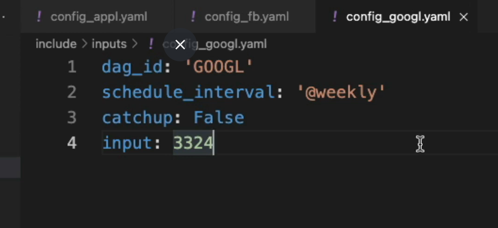
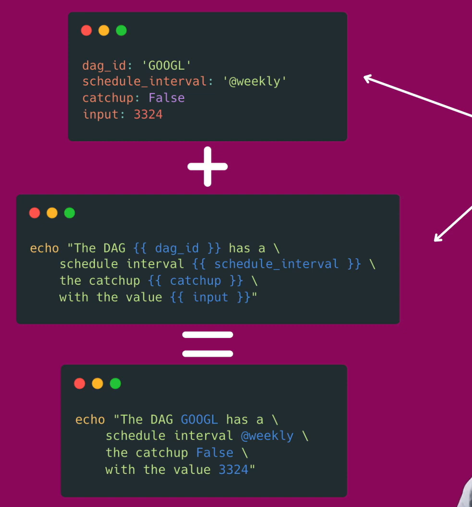
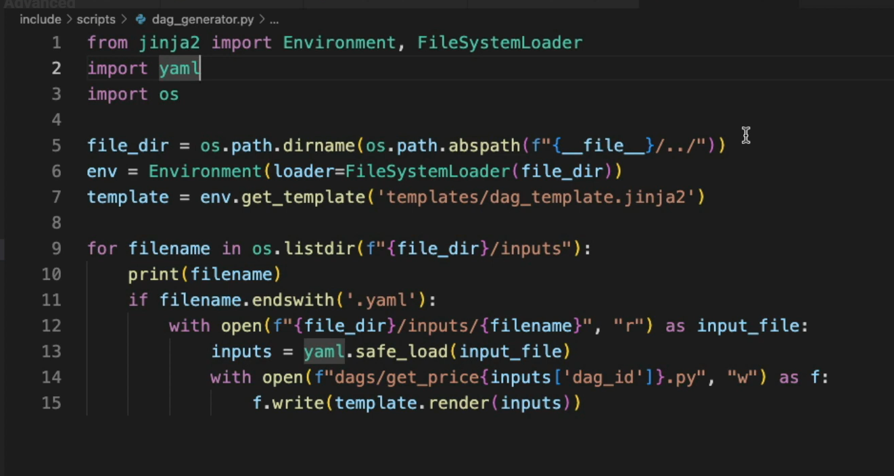

mkdir tutorial

cd tutorial

astro dev init



open it in vs code




add inputs folder
config_appl.yaml

duplicate the config_appl.yaml file twice

```yaml
config_fb.yaml
dag_id: 'FB'
schedule_interval: '@daily'
catchup: False
input: 220
```
config_gool.yaml
```yaml
dag_id: 'GOOGL'
schedule_interval: '@weekly'
catchup: False
input: 3324

```




Go back to inputs -> create anothe folder ->templates

within templates folder -> create new file dag_template.jinja2


)
```

---

## 🧪 Example 3 — Using Params with Jinja

```python
PythonOperator(
    task_id="process",
    python_callable=process_data,
    params={"table_name": "orders"},
    op_kwargs={"table": "{{ params.table_name }}"}
)
```

---

## ✨ How to Write Jinja2 Code in Markdown

Use a fenced code block:

````markdown
```sql
SELECT * FROM orders WHERE order_date = '{{ ds }}';
```
````

### Example with logic

````markdown
```python

    SELECT * FROM india_sales;

    SELECT * FROM global_sales;

```
````

### Example with loop

````markdown
```python

    SELECT * FROM {{ table }};

```
````

---

## 🎯 Summary
- Jinja2 enables dynamic, parameterized DAGs.
- Works with SQL, BashOperator, PythonOperator, EmailOperator, templates.
- Macros like `ds`, `next_ds`, `dag_run.run_id` help automate date handling.
- Markdown notation uses fenced blocks with `jinja`.
dag_template.jinja2


# Come back to our demo
```python
from airflow import DAG
from airflow.decorators import task
from datetime import datetime


with DAG("get_price_{{ dag_id }}", start_date=datetime(2022, 1, 1), schedule_interval="{{ schedule_interval }}",
         catchup={{ catchup or False }}) as dag:

    @task
    def extract(stock):
        return stock

    @task
    def process(stock):
        return stock

    @task
    def send_email(stock):
        print(stock)
        return stock

    send_email(process(extract({{ input }})))


```

Goto include

create scripts folder - > dag_generator.py


```python
from jinja2 import Environment, FileSystemLoader
import yaml
import os

file_dir = os.path.dirname(os.path.abspath(f"{__file__}/.."))
env = Environment(loader=FileSystemLoader(file_dir))
template = env.get_template('templates/dag_template.jinja2')

for filename in os.listdir(f"{file_dir}/inputs"):
    print(filename)
    if filename.endswith('.yaml'):
        with open(f"{file_dir}/inputs/{filename}", "r") as input_file:
            inputs = yaml.safe_load(input_file)
        with open(f"dags/get_price_{inputs['dag_id']}.py", "w") as f:
            f.write(template.render(inputs))

```


astro dev start
