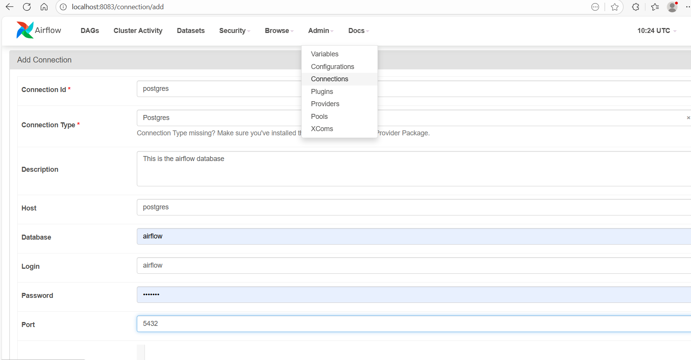
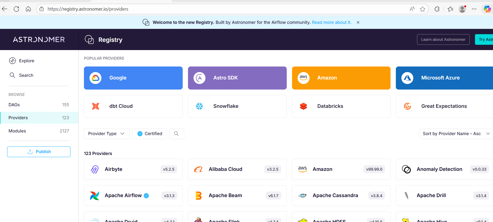

create a new file in a dags folder with the name of user_processing.py

```python
from airflow.sdk import dag
from airflow.providers.common.sql.operators.sql import SQLExecuteQueryOperator

@dag
def user_processing():
    
    create_table = SQLExecuteQueryOperator(
        task_id="create_table",
        conn_id="postgres",
        sql="""
        CREATE TABLE IF NOT EXISTS users (
            id INT PRIMARY KEY,
            firstname VARCHAR(255),
            lastname VARCHAR(255),
            email VARCHAR(255),
            created_at TIMESTAMP DEFAULT CURRENT_TIMESTAMP
        )
        """
    )
    
user_processing()
```




# What is Provider?

https://registry.astronomer.io/



filesensor
s3sensor
