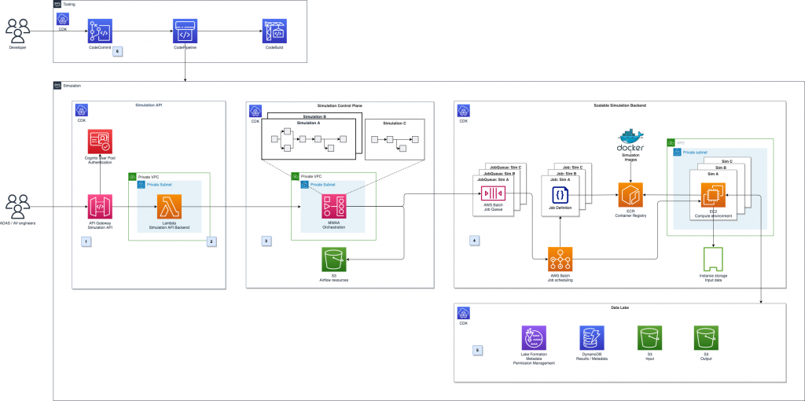
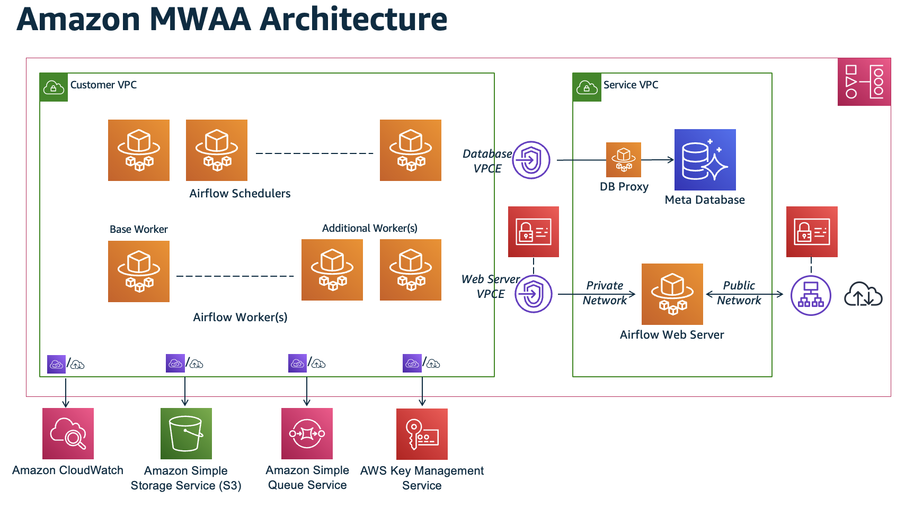
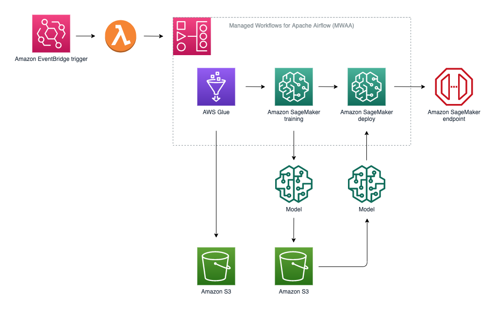
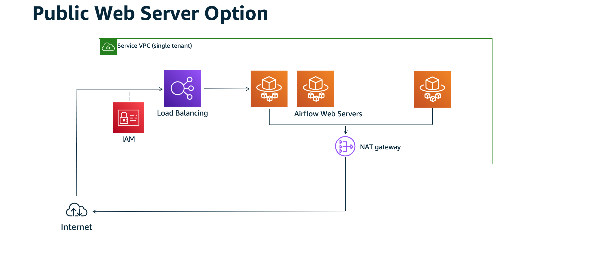
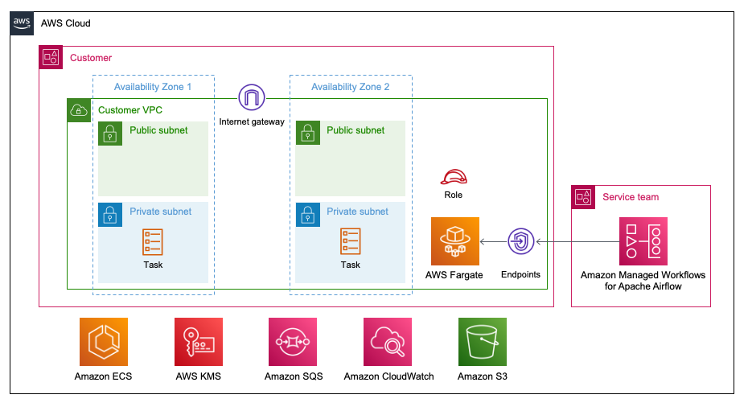
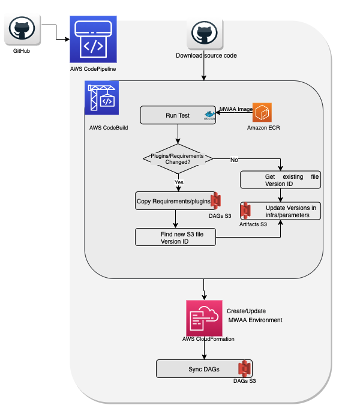
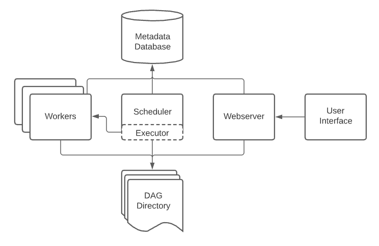
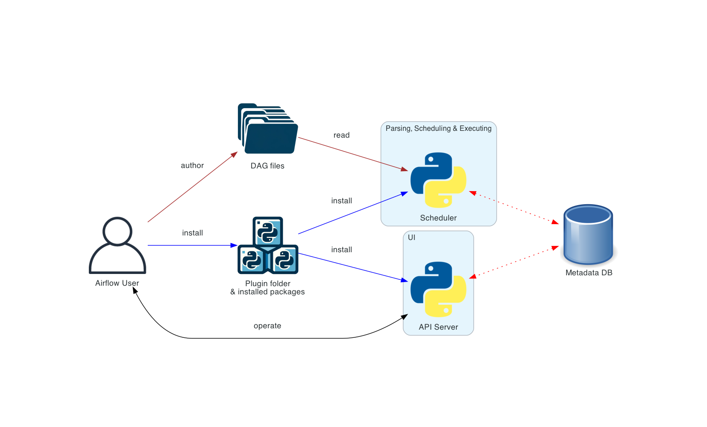

# Amazon MWAA (Managed Workflows for Apache Airflow)





🌟 1. What is Amazon MWAA?

Amazon MWAA is a **fully managed Apache Airflow service** on AWS.
You use MWAA to orchestrate pipelines such as ETL, data ingestion, machine learning workflows, and cloud automation.

  ## ✔ Simple Definition

Amazon MWAA lets you run Airflow without installing anything, without maintaining servers, without scaling manually, and without worrying about Airflow upgrades.
AWS manages everything.

# 🌟 2. Why Should You Use Amazon MWAA?
## ✔ 1. No Infrastructure to Manage

No need to install Airflow on EC2, Docker, Kubernetes, Python, Postgres, etc.

AWS manages the entire Airflow setup for you.

## ✔ 2. Auto-Scaling

Airflow Schedulers and Workers automatically scale based on your DAG workload.

No manual tuning required.

## ✔ 3. Secure by Default

Fully integrated with AWS VPC networking.

IAM role-based access control for secure execution.

S3 storage for DAGs.

CloudWatch Logs for complete observability.

## ✔ 4. High Availability

Amazon MWAA runs Airflow across multiple Availability Zones.

Ensures resilience and uptime for production workloads.

## ✔ 5. Native Integration with AWS

Easily connect to AWS services such as:

S3

Redshift

Glue

EMR

Lambda

RDS

Kinesis

DynamoDB

Step Functions

## ✔ 6. Best for Enterprise-Grade ETL/ELT Pipelines

Perfect for large-scale:

Finance

Healthcare

Retail

E-commerce

Data Engineering + Analytics pipelines
---

## 3. MWAA Architecture



MWAA includes:
| Component             | Description                         |
| --------------------- | ----------------------------------- |
| **Airflow Webserver** | Hosted and secured by AWS           |
| **Airflow Scheduler** | Automatically scaled                |
| **Airflow Workers**   | Executes tasks                      |
| **Amazon S3**         | Stores DAG files and plugins        |
| **Amazon CloudWatch** | Stores logs                         |
| **IAM Role**          | Provides permissions                |
| **Amazon VPC**        | Secure environment for execution    |
| **Airflow database**  | Managed by AWS (no access required) |


## 🌟 4. Amazon MWAA Setup – Step-by-Step (Beginner-Friendly)

This is the official sequence followed in AWS.

### ✅ Step 1: Create an S3 Bucket for Airflow

Create an S3 bucket (example):
```
mwaa-gopi-project
```
Inside bucket create folders: 
Create folders:
```
/dags
/plugins
/requirements
```

Upload DAG files into `/dags`.

---

### Step 2: Create IAM Role for MWAA
Go to IAM → Roles → Create Role
Choose → MWAA

Attach policies:
- AmazonS3ReadOnlyAccess

- CloudWatchLogsFullAccess

- AmazonRedshiftFullAccess (optional)

- AmazonGlueConsoleAccess (optional)

- AmazonDynamoDBFullAccess (optional)

- Custom policy to access specific resources

This becomes **Execution Role** of MWAA.

---

## ✅ Step 3: Create a VPC Setup

MWAA must run inside a private VPC.

Requirements:
- 2 Private Subnets across 2 Availability Zones  
- A NAT Gateway in a Public Subnet  
- Internet Gateway  
- Route tables for outbound traffic  

MWAA uses workers → need NAT to download Python libraries.

---
## ✅ Step 4: Install Python Dependencies (Optional)
### Step 4: Create a `requirements.txt`

Example:
```
apache-airflow-providers-amazon
pandas
boto3
```

Upload to:
```
requirements/requirements.txt
```

---

### Step 5: Create MWAA Environment

Go to AWS Console → MWAA → Create Environment

Important Fields:

| Setting               | Value                                                       |
| --------------------- | ----------------------------------------------------------- |
| **Environment Name**  | gopi-mwaa-env                                               |
| **Airflow Version**   | 2.7 or latest                                               |
| **DAGs Folder**       | s3://mwaa-gopi-project-bucket/dags                          |
| **Plugins Folder**    | s3://mwaa-gopi-project-bucket/plugins                       |
| **Requirements File** | s3://mwaa-gopi-project-bucket/requirements/requirements.txt |
| **Execution Role**    | Use the IAM role you created                                |
| **Schedulers**        | 1–2 (autoscaling)                                           |
| **Webserver access**  | Public or Private                                           |
| **Logging**           | CloudWatch Enabled                                          |
| **Networking**        | Choose your VPC and private subnets                         |


Environment creation time: **20–30 minutes**.

---

## 🌟 5. How MWAA Works





**Step-by-step internal workflow:**

- You upload DAG files to S3
- MWAA webserver reads files
- Scheduler picks DAG
- Worker executes tasks
- Logs stored in CloudWatch

Results stored in databases/storage systems

## 🌟 6. Real-World Use Case – Retail Data Pipeline
### 🎯 Scenario

A retail company wants to process daily sales data from multiple stores and load it into Redshift for analytics.
Retail stores upload daily sales CSV files into Amazon S3.  
A workflow should:
1. Validate sales CSV  
2. Clean it using Glue  
3. Load into Redshift  
4. Send email notification  
#### ✔ Data Sources

- S3 bucket → Raw sales data
- AWS Glue → Transform data
- Redshift → Final table

###  📌 Solution using Amazon MWAA
**DAG Flow**
extract_sales_from_s3 → clean_data_with_glue → load_into_redshift → send_notificati
on

### DAG Flow
```
extract → transform → load → notify
```

---

## 7. Sample MWAA DAG Code

```python
from airflow import DAG
from airflow.operators.python import PythonOperator
from airflow.providers.amazon.aws.operators.glue import GlueJobOperator
from airflow.providers.amazon.aws.operators.redshift_data import RedshiftDataOperator
from airflow.providers.amazon.aws.operators.sns import SnsPublishOperator
from datetime import datetime

def extract_data():
    print("Extracting daily sales from S3...")

with DAG(
    dag_id="daily_retail_etl",
    description="Daily retail ETL pipeline using MWAA",
    schedule_interval="@daily",
    start_date=datetime(2024, 1, 1),
    catchup=False
) as dag:

    extract_task = PythonOperator(
        task_id="extract_sales",
        python_callable=extract_data
    )

    transform_task = GlueJobOperator(
        task_id="transform_sales",
        job_name="glue_sales_job"
    )

    load_task = RedshiftDataOperator(
        task_id="load_sales",
        cluster_identifier="redshift-cluster",
        database="retaildb",
        sql="COPY sales FROM 's3://processed/sales/' IAM_ROLE 'arn:aws:iam::123456789:role/redshift-role'"
    )

    notify_task = SnsPublishOperator(
        task_id="notify_success",
        target_arn="arn:aws:sns:ap-south-1:123456789:retail_topic",
        message="Daily ETL pipeline completed!"
    )

    extract_task >> transform_task >> load_task >> notify_task
```

---

## 8. MWAA Environment Configuration

### Environment Classes
| Class | Best For |
|-------|----------|
| mw1.small | Dev/test |
| mw1.medium | Medium ETL |
| mw1.large | Heavy ML/ETL workloads |

### Schedulers
1 or 2 schedulers recommended.

- Minimum: 1
- Max: 5
More schedulers → faster DAG parsing.

### 3. Workers
Autoscaled by AWS based on your DAG load.

### 4. Webserver Access

- Private – Enterprise
- Public – Development/testing

### Logs
Store in CloudWatch:
- DAG processing logs  
- Task logs  
- Worker logs  

---
6. Networking

- 2 private subnets
- NAT gateway
- Security groups allowed for S3, AWS API endpoints

## 9. MWAA Cost Overview

MWAA is paid per hour + logs + S3 + NAT.

Typical Indian pricing:
- **₹15/hour – ₹60/hour**
- Logs: ₹100 – ₹1,000 monthly  
- S3 storage extra  

Monthly cost:  
**₹8,000 – ₹25,000**

---
## 🌟 8. When to Use MWAA?
### ✔ Ideal Use Cases:

- Data Engineering Pipelines
- Machine Learning workflow orchestration
- ETL/ELT pipelines
- Cross-AWS automated jobs
- Real-time or batch scheduling workflows
- Multi-step pipelines (Lambda → Glue → Redshift → SNS)

## ✔ When NOT to Use:

Very small projects

If you cannot spend money (MWAA is not free)

If you want full server control (use EC2-based Airflow)
## 10. Summary

| Feature | Benefit |
|--------|---------|
| Fully Managed service | No Airflow installation |
| Auto scaling workers | Saves cost |
| Integrates with AWS services | Glue, Lambda, Redshift |
| Secure | IAM, VPC |
| Enterprise Grade | HA, resilient |

---

## End of Document
