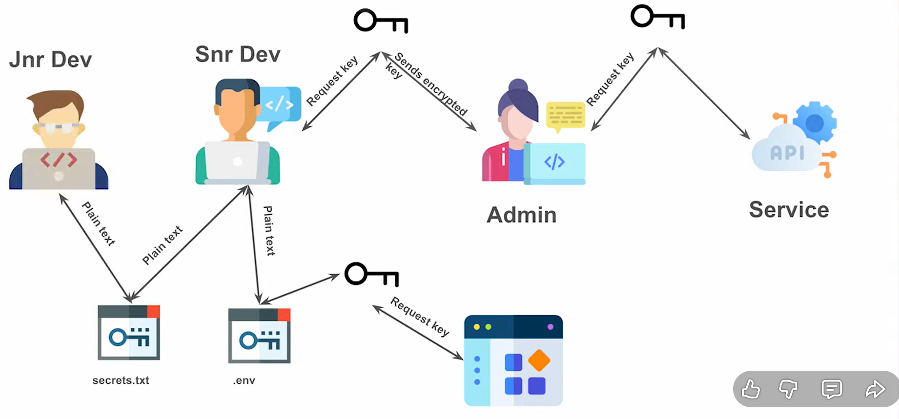
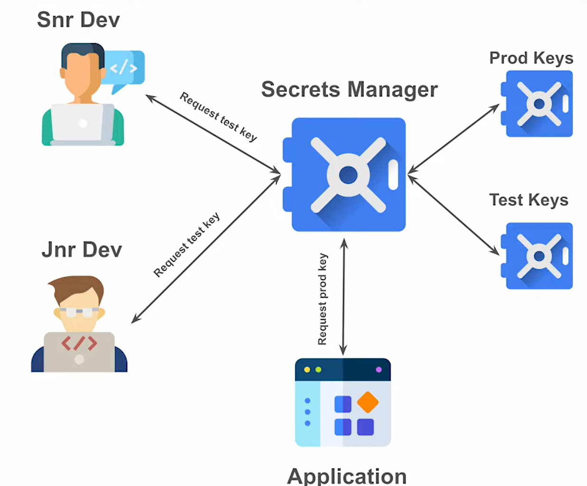
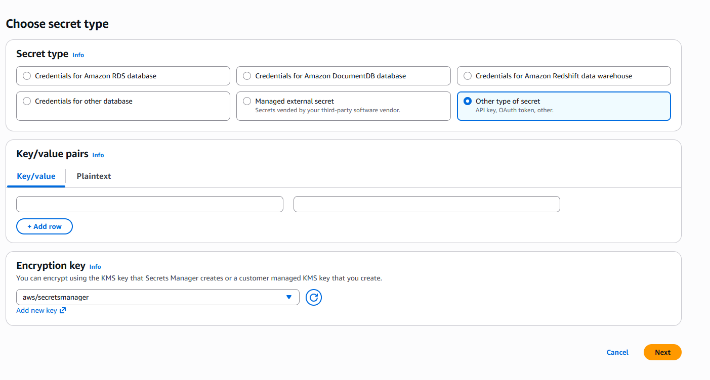
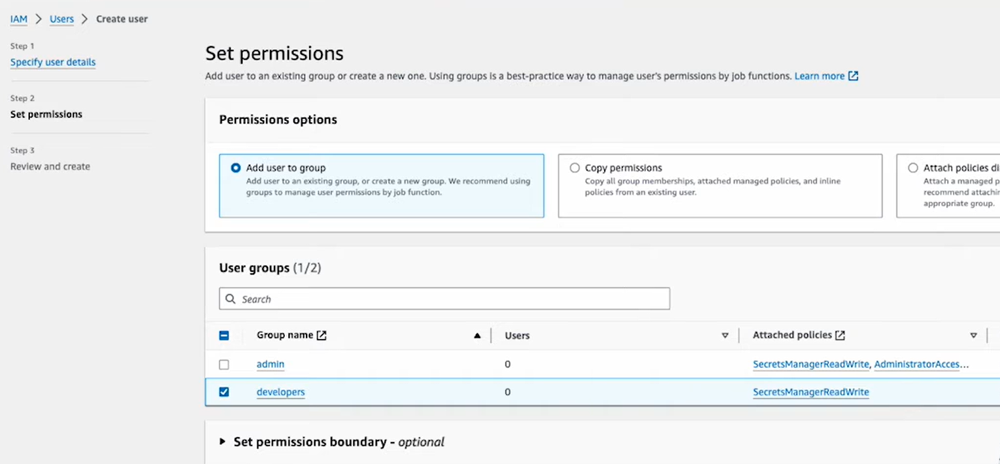

after save secrets. 
Iam user =>snr_dev => add user group

after creating user
open terminal
install aws cli tool

aws cli tool

type  aws 

goback to users -> Security credentials =>command line interface ->Access key

In terminal ->  aws configure
