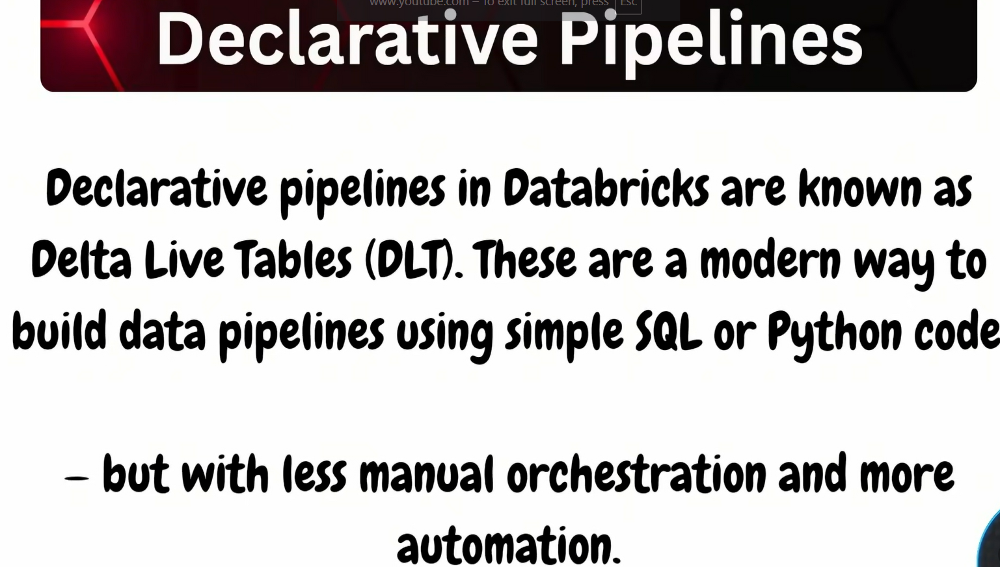

in sql editor
create table orders

```sql
CREATE TABLE orders
(
    order_id INT,
    order_date DATE,
    customer_id INT,
    order_status STRING
);

INSERT INTO orders
VALUES
    (1, '2020-01-01', 1, 'COMPLETE'),
    (2, '2020-01-02', 2, 'PENDING'),
    (3, '2020-01-03', 3, 'COMPLETE'),
    (4, '2020-01-04', 4, 'CANCELLED'),
    (5, '2020-01-05', 5, 'COMPLETE');
```

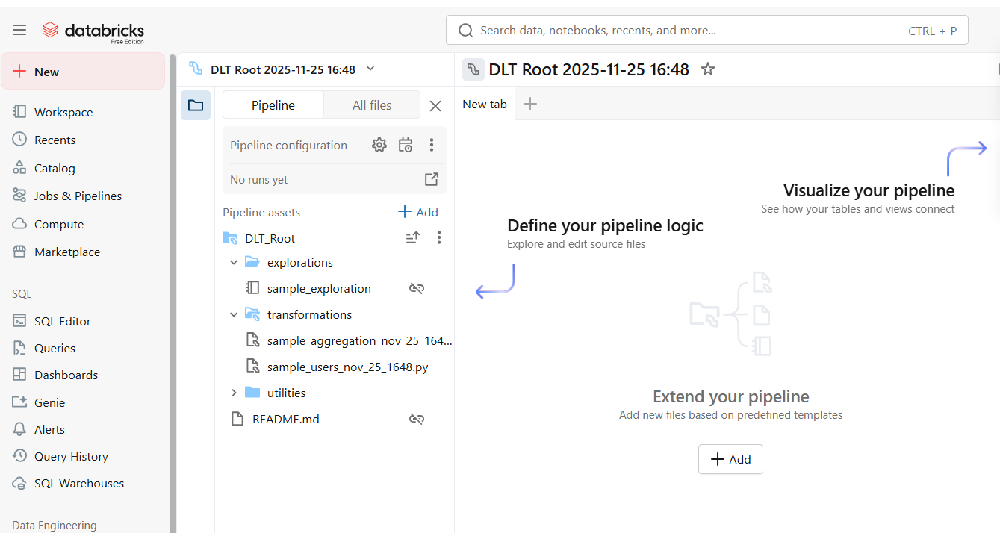
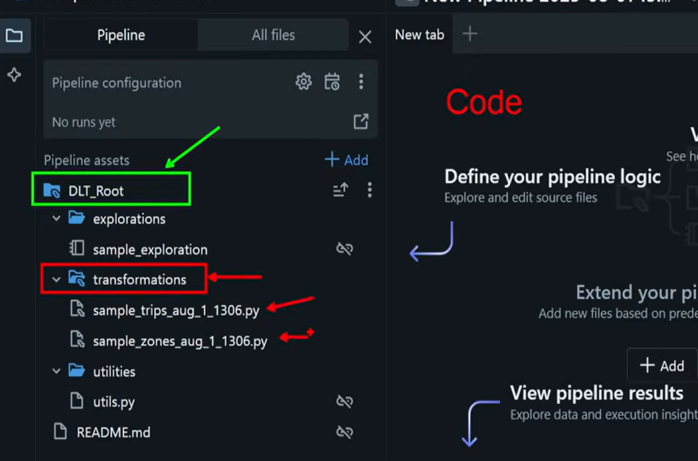

Each folder has a **specific purpose**.  
Below is a detailed explanation.

---

## 🟩 1. `DLT_Root/` — Main Project Folder

This is the **root directory** of your entire Delta Live Tables pipeline.

It contains:

- Notebooks  
- Python transformation scripts  
- Utility modules  
- Configuration files  
- Documentation (`README.md`)

Think of this as the **top-level project folder**, similar to the root of a Git repository.

### 📌 When you run the pipeline, Databricks scans this folder for:

- Transformation logic  
- Exploration notebooks  
- Utility scripts  
- Any Python packages you import  

---

## 🟥 2. `explorations/` — Data Exploration Notebooks

This folder contains notebooks used for **exploration and testing**, *not* for production pipeline execution.

### You use this folder for:

- Trying out data samples  
- Writing trial SQL queries  
- Understanding schemas  
- Prototyping logic before converting it to a DLT table  
- Debugging transformations  

### 📌 Important  
Files inside `explorations/` **do not run as part of the DLT pipeline**.

---

## 🟥 3. `transformations/` — Pipeline Transformation Scripts

This is the **most important folder** in a DLT project.

Everything inside **becomes part of the actual pipeline**.

Common files:

- `sample_trips_aug_1_1306.py`  
- `sample_zones_aug_1_1306.py`

These files typically define DLT logic such as:

```python
@dlt.table
def bronze_table():
    ...
```


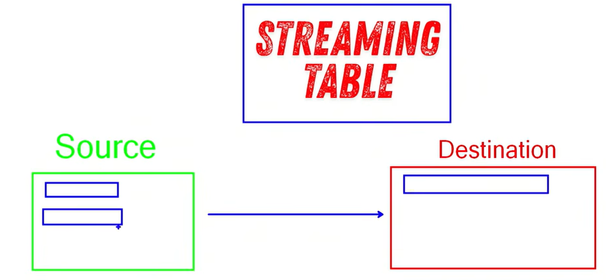
# 📡 Understanding Streaming Data (Based on the Picture)

Your diagram shows the basic idea of **streaming ETL** (Extract → Transform → Load) in a continuous data pipeline.

---

# 🟩 1. Source (Green Box)

This represents the **incoming data** that arrives continuously.

### Examples of streaming sources:
- Kafka topic  
- Event Hub / Kinesis  
- Delta table with streaming updates  
- Folder where new files keep landing (JSON, CSV, Parquet…)  
- IoT device data  
- Website clickstream events  

### ✔ Key points:
- Data arrives **incrementally**, not all at once  
- New records continuously appear  
- Databricks reads this using:

```python
spark.readStream.format(...)
## 🔵 2. Streaming Table (Blue Box – Center)

This represents the **real-time processing layer** in a streaming pipeline.

A streaming table:

- Continuously reads new incoming data  
- Processes it as soon as it arrives  
- Forwards the processed data to downstream tables  
- Acts as the “live engine” of your pipeline  

---

### 🧱 Delta Live Tables (DLT) Example

```python
@dlt.table(
    comment="A streaming table"
)
def streaming_table():
    return (
        spark.readStream.format("cloudFiles")
            .option("cloudFiles.format", "json")
            .load("/mnt/source")
    )
```
## 📝 Summary

A Streaming Table is a continuously running, real-time processing engine that ingests new data as it arrives, transforms it, and outputs it instantly — ideal for dashboards, fraud detection, IoT, logs, and any real-time analytics use case.
----

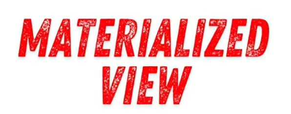

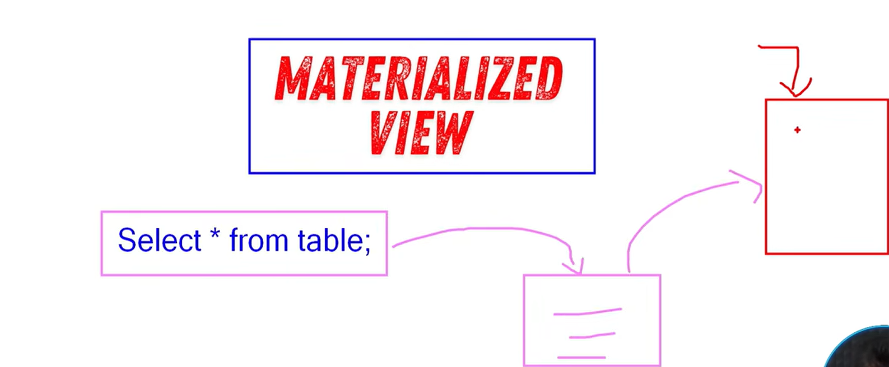

## ⭐ 1. What is a View?

A **View** in Databricks is a **logical / virtual table**.

- It **does not store data**
- It runs the query **every time** you read it
- Stored only as metadata in the metastore

### 🔹 Example

```sql
CREATE VIEW high_value_orders AS
SELECT * FROM orders
WHERE amount > 1000;
```

Querying the view:

```sql
SELECT * FROM high_value_orders;
```

Databricks re-runs the underlying SELECT each time.

---


# Demo 

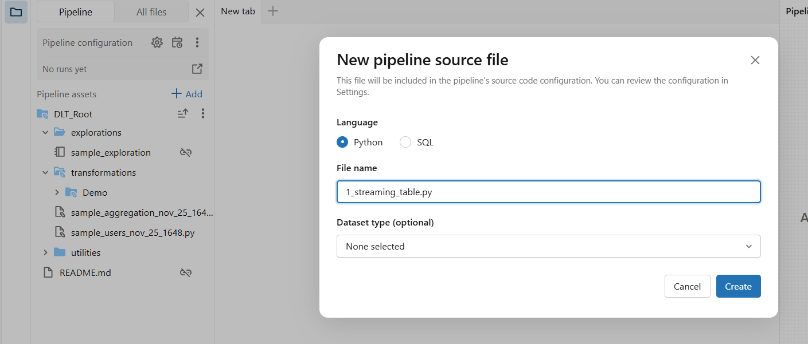

```python
import dlt

# Create Streaming Table
import dlt

@dlt.table(
    name="first_stream_table"
)
def first_stream_table():
    df = spark.readStream.table("dlt_catalog.dlt_schema.orders")
    return df

```

Dry Run 
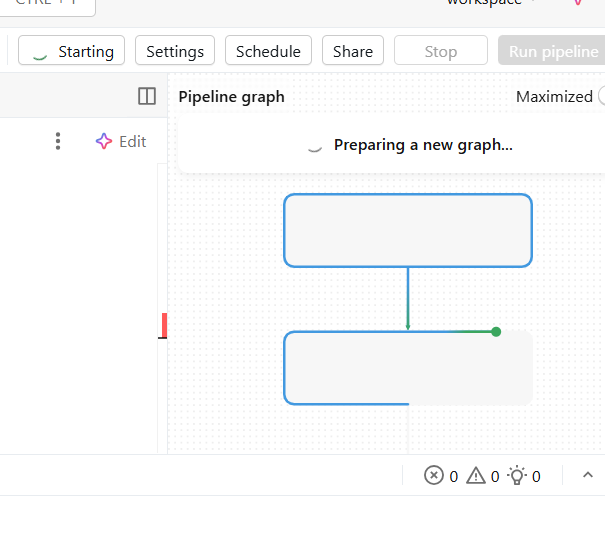
It will create graph.
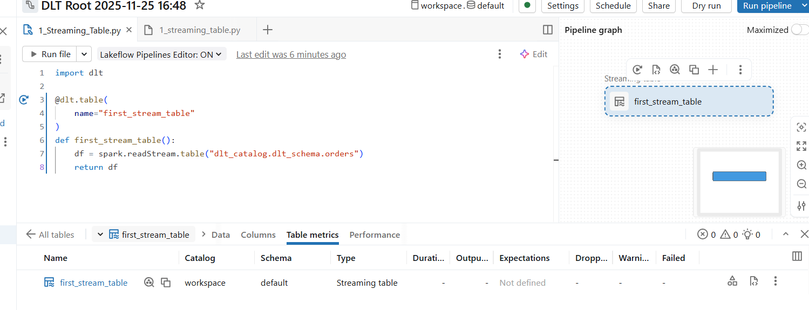

Run Pipeline
it will create table

## ⭐ 2. What is a Materialized View?

A **Materialized View (MV)** is a **pre-computed physical table**.

- Stores results on disk  
- Faster performance for repeated queries  
- Supports **incremental refresh**  
- Ideal for BI dashboards  

### 🔹 Example

```python
# Create Materialized view

@dlt.table(
    name="first_mat_view"
)

def first_mat_view():
    df=spark.read.table("dlt_catalog.dlt_schema.orders")
    return df
```
Run pipeline.

Previously Both Streaming table and mat view had output 5 rows. 
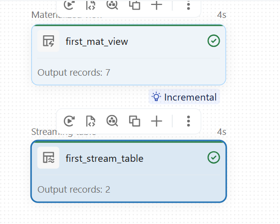

Now streaming table has output 2 
whereas mat_view has output 7 rows
```sql
CREATE MATERIALIZED VIEW mv_daily_sales AS
SELECT date(order_date) AS order_day,
       SUM(amount) AS total_sales
FROM orders
GROUP BY date(order_date);
```
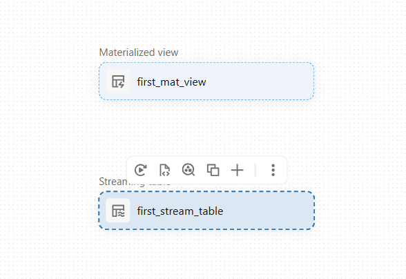
---


## ⭐ 3. What is a Batch View?

A **Batch View** is produced using **batch processing**, not real-time.

- Processes full or incremental batches  
- Runs on a schedule (e.g., hourly/daily)  
- Stored as a physical table  
- Typical for ETL Silver/Gold layers  

### 🔹 Example (DLT Batch Table)
```python
# create batch view
@dlt.table(
    name="first_batch_view"
)
def first_batch_view():
    df=spark.readStream.table("dlt_catalog.dlt_schema.orders")
    return df
```

```python
import dlt

@dlt.table
def silver_orders():
    return spark.table("bronze_orders").filter("order_status != 'CANCELLED'")
```
---
if you want you can rename the file as 1_core_components.py


Add new file as 2_dependency.py in demo folder (source folder)
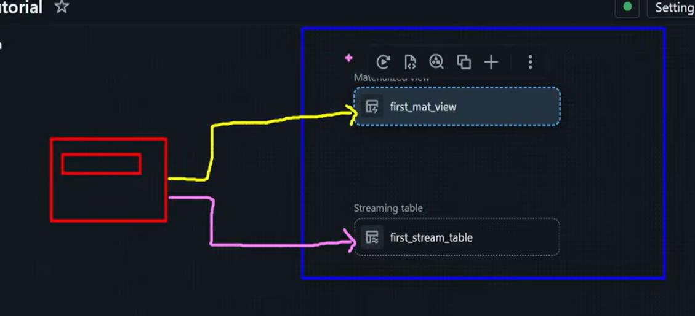
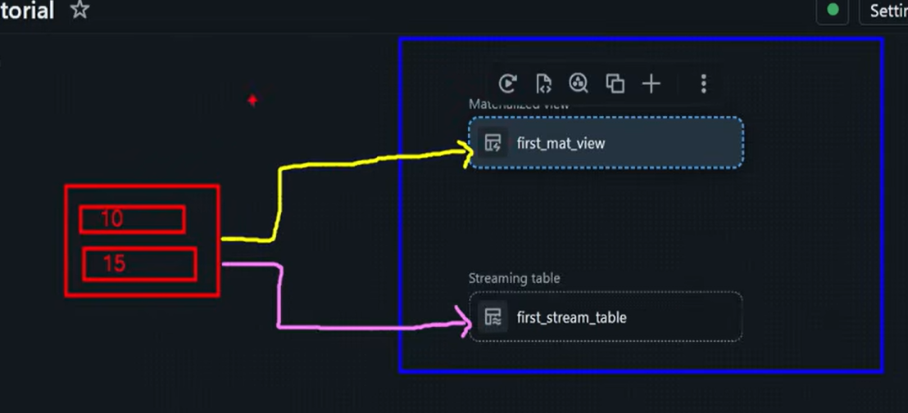
Materialized view is batch processing .It will read all data
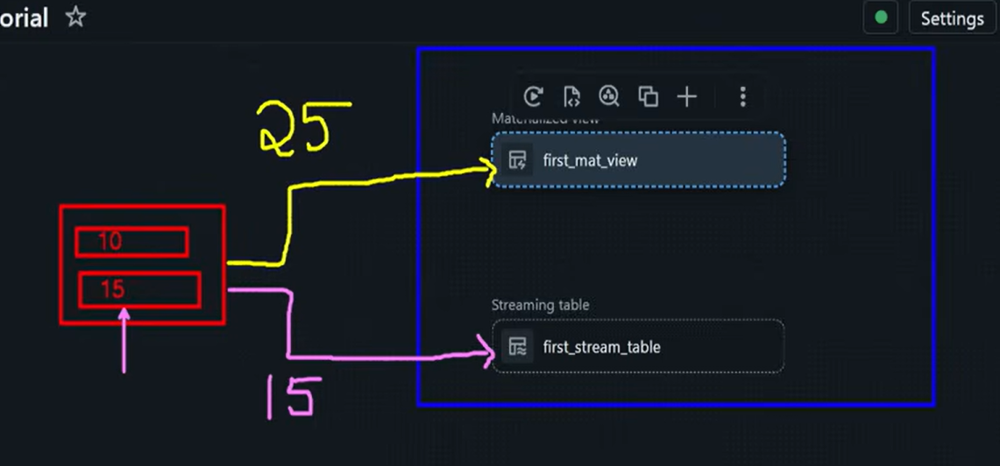

to check that we need to **run pipeline.**
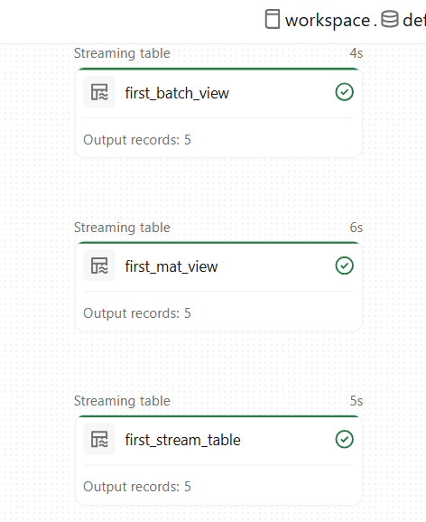

Add new file as 2_dependency.py in demo folder (Demo or source folder)
```python
import dlt
'''creating an  End-To-End Base Pipeline'''

#staging area
@dlt.table(
    name="staging_orders"
)
def staging_orders():
    df=spark.readStream.table("dlt_catalog.dlt_schema.orders")
    return df

# Creating Transformed Area
@dlt.view(
    name="transformed_orders"
)
def transformed_orders():
    df=spark.readStream.table("LIVE.staging_orders")
    return df
    
```
Now do Dry Run.

While you run  all code will run even in first file. Make sure you don't want you can comment the code in first (1_Core_Component.py) file.

Dry run actually not creating table in permenant storage. But your transformed data was created from  LIVE table staging_orders using LIVE.staging_orders


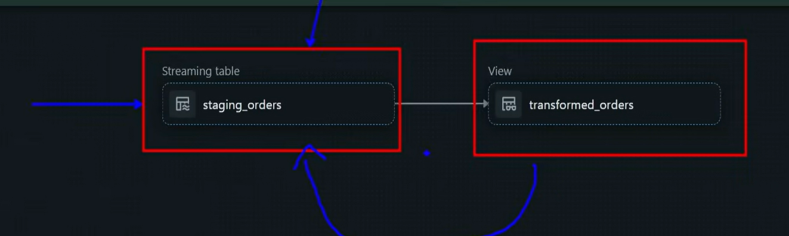


If you want to run any python code with in pipeline.
Goto  Exploration Folder -> open Sample Exploration file there you can write everything and run.

Your notebooks which is explorations does not run when you are running pipeline.  as it is not in source folder

``` python
import dlt

from pyspark.sql.functions import *
'''creating an  End-To-End Base Pipeline'''

#staging area
@dlt.table(
    name="staging_orders"
)
def staging_orders():
    df=spark.readStream.table("dlt_catalog.dlt_schema.orders")
    return df

# Creating Transformed Area
@dlt.view(
    name="transformed_orders"
)
def transformed_orders():
    df=spark.readStream.table("LIVE.staging_orders")
    df=df.withColumn("order_status",lower(col("order_status")))
    return df
    

# Creating aggregated Area
@dlt.table(
    name="aggregated_orders"
)

def aggregated_orders():
    df=spark.readStream.table("transformed_orders")
    df=df.groupBy("order_status").count()
    return df


```
Dry Run

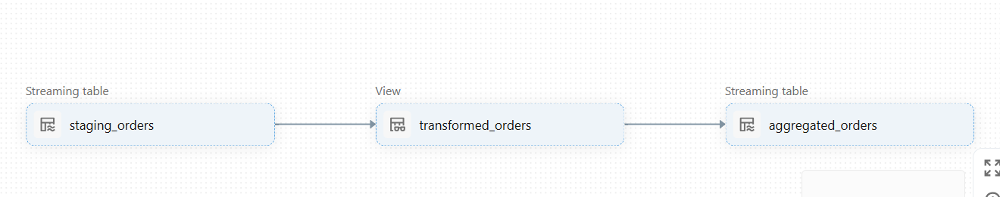

Here in the above code we have not specified LIVE.transformed_orders
still it is mapping. 

That is called Lineage

## ⭐ 4. What is a Streaming View?

A **Streaming View** is built using **Spark Structured Streaming** or **DLT Streaming Tables**.

- Continuously updates  
- Processes data in micro-batches  
- Handles late/out-of-order events  
- Supports exactly-once processing  
- 
Add new file as 2_dependency.py in demo folder (source folder)

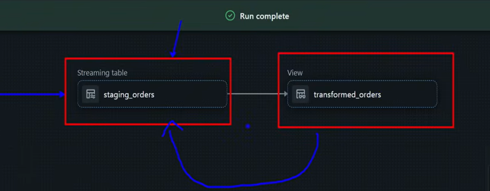
### 🔹 Example

```python
@dlt.table(
  table_properties={"quality": "bronze"},
  comment="Streaming ingestion table"
)
def bronze_orders_stream():
    return spark.readStream.format("cloudFiles")            .option("cloudFiles.format", "json")            .load("/mnt/source/orders")
```

---
## 📌 Final Summary Table

| Type | Stores Data? | Updates | Use Case |
|------|--------------|---------|----------|
| **View** | ❌ No | Every query | Lightweight logic |
| **Materialized View** | ✔ Yes | Incremental | Dashboards |
| **Batch View** | ✔ Yes | Scheduled batch | ETL Silver/Gold |
| **Streaming View** | ✔ Yes | Real-time | IoT, logs, events |

-----


