## 🧩 End-to-End Databricks Example


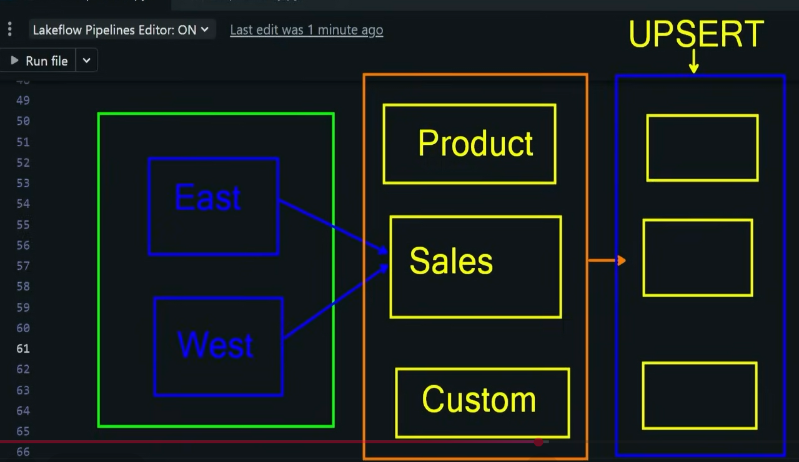

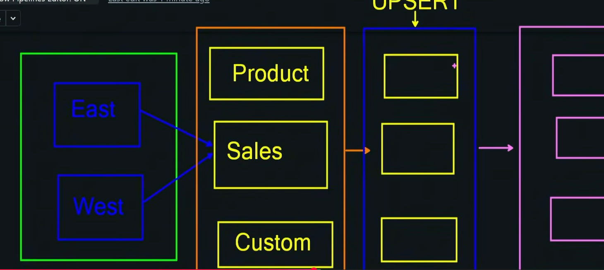
```sql
CREATE TABLE sales_east (
    sales_id INT PRIMARY KEY,
    customer_id INT,
    product_id INT,
    quantity INT,
    amount DECIMAL(10,2),
    sale_timestamp TIMESTAMP
);

-- # Insert 1 (Initial Load)
INSERT INTO sales_east VALUES
(1, 101, 201, 2, 200.00, '2025-08-01 10:00:00'),
(2, 102, 202, 1, 120.00, '2025-08-01 10:05:00'),
(3, 103, 203, 5, 500.00, '2025-08-01 10:10:00'),
(4, 104, 204, 3, 330.00, '2025-08-01 10:15:00'),
(5, 105, 205, 4, 440.00, '2025-08-01 10:20:00');

-- # Insert 2 (Incremental Load)
INSERT INTO sales_east VALUES
(6, 101, 203, 1, 100.00, '2025-08-02 09:00:00'),
(7, 106, 206, 2, 250.00, '2025-08-02 09:15:00');

-----------------------------------------------------------------------------------
--create table sales_west
CREATE TABLE sales_west (
    sales_id INT PRIMARY KEY,
    customer_id INT,
    product_id INT,
    quantity INT,
    amount DECIMAL(10,2),
    sale_timestamp TIMESTAMP
);

-- Insert 1 (Initial Load)
INSERT INTO sales_west VALUES
(8, 107, 207, 1, 150.00, '2025-08-01 11:00:00'),
(9, 108, 208, 2, 260.00, '2025-08-01 11:05:00'),
(10, 109, 209, 3, 390.00, '2025-08-01 11:10:00'),
(11, 110, 210, 1, 130.00, '2025-08-01 11:15:00'),
(12, 111, 211, 4, 560.00, '2025-08-01 11:20:00');

-- Insert 2 (Incremental Load)
INSERT INTO sales_west VALUES
(13, 112, 212, 2, 300.00, '2025-08-02 09:30:00'),
(14, 107, 208, 1, 130.00, '2025-08-02 09:45:00');


---------------------------------------------------------------


CREATE TABLE products (
    product_id INT PRIMARY KEY,
    product_name VARCHAR(100),
    category VARCHAR(50),
    price DECIMAL(10,2),
    last_updated TIMESTAMP
);

--  Insert 1 (Initial Load)
INSERT INTO products VALUES
(201, 'Laptop', 'Electronics', 1000.00, '2025-07-31 12:00:00'),
(202, 'Phone', 'Electronics', 120.00, '2025-07-31 12:05:00'),
(203, 'Monitor', 'Electronics', 100.00, '2025-07-31 12:10:00'),
(204, 'Chair', 'Furniture', 110.00, '2025-07-31 12:15:00'),
(205, 'Desk', 'Furniture', 150.00, '2025-07-31 12:20:00'),
(206, 'Mouse', 'Electronics', 50.00, '2025-07-31 12:25:00'),
(207, 'Keyboard', 'Electronics', 60.00, '2025-07-31 12:30:00'),
(208, 'Lamp', 'Furniture', 130.00, '2025-07-31 12:35:00'),
(209, 'Router', 'Electronics', 130.00, '2025-07-31 12:40:00'),
(210, 'Table', 'Furniture', 130.00, '2025-07-31 12:45:00'),
(211, 'Notebook', 'Stationery', 140.00, '2025-07-31 12:50:00'),
(212, 'Pen', 'Stationery', 150.00, '2025-07-31 12:55:00');


--  Insert 2 (SCD Update)
-- Price change for product_id 203
INSERT INTO products VALUES
(203, 'Monitor', 'Electronics', 90.00, '2025-08-02 08:00:00');

-- Name change for product_id 208
INSERT INTO products VALUES
(208, 'Desk Lamp', 'Furniture', 130.00, '2025-08-02 08:10:00');


----------------------------------------------------------------------------------------------------


CREATE TABLE customers (
    customer_id INT PRIMARY KEY,
    customer_name VARCHAR(100),
    region VARCHAR(50),
    last_updated TIMESTAMP
);


--  Insert 1 (Initial Load)
INSERT INTO customers VALUES
(101, 'Alice', 'East', '2025-07-31 13:00:00'),
(102, 'Bob', 'East', '2025-07-31 13:05:00'),
(103, 'Charlie', 'East', '2025-07-31 13:10:00'),
(104, 'Diana', 'East', '2025-07-31 13:15:00'),
(105, 'Ethan', 'East', '2025-07-31 13:20:00'),
(106, 'Fiona', 'East', '2025-07-31 13:25:00'),
(107, 'George', 'West', '2025-07-31 13:30:00'),
(108, 'Hannah', 'West', '2025-07-31 13:35:00'),
(109, 'Ian', 'West', '2025-07-31 13:40:00'),
(110, 'Jane', 'West', '2025-07-31 13:45:00'),
(111, 'Kevin', 'West', '2025-07-31 13:50:00'),
(112, 'Laura', 'West', '2025-07-31 13:55:00');


 Insert 2 (SCD Update)
-- Region change for customer 103
INSERT INTO customers VALUES
(103, 'Charlie', 'Central', '2025-08-02 08:30:00');

-- Name correction for customer 107
INSERT INTO customers VALUES
(107, 'George Smith', 'West', '2025-08-02 08:40:00');

```
Execute only create table and  initial insert. 
Do not Execute the incremental insert
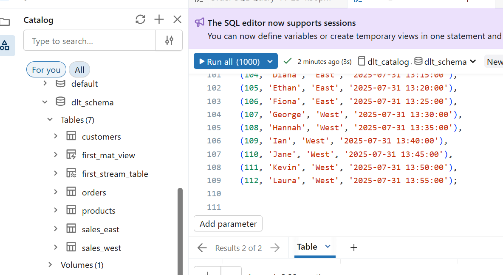


in ETL Pipeline Transformation 
Add New Folder ->bronze
Add new python file -ingestion_sales


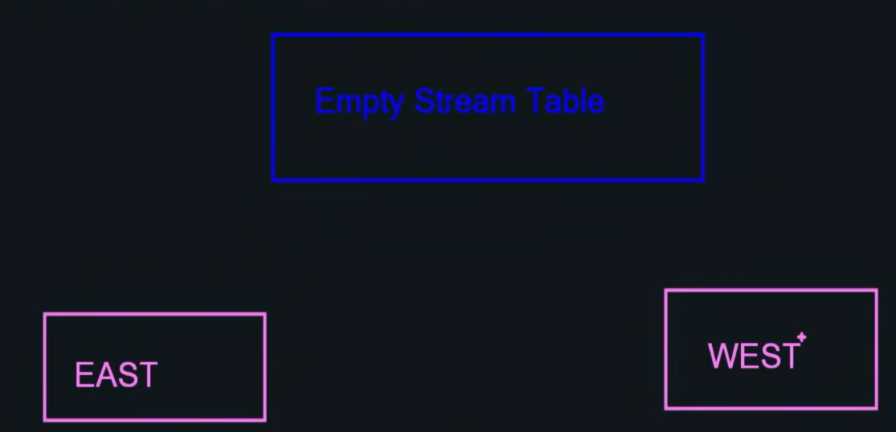

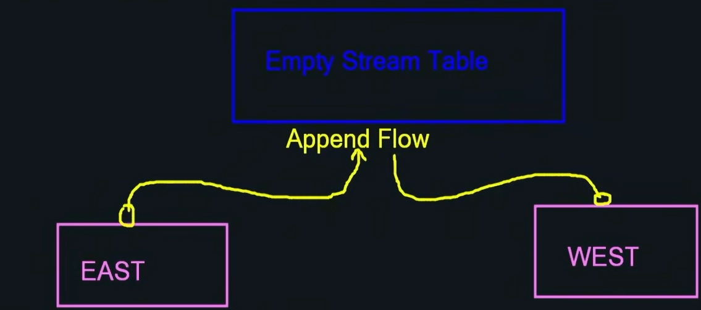

### ingestion_sales.py
```python
import dlt

# Empty Streaming table
dlt.create_streaming_table(
    name="append_sales"
)

# Creating East sales flow
@dlt.append_flow(target="append_sales")
def east_sales():
    df=spark.readStream.table("dlt_catalog.dlt_schema.sales_east")
    return df

# Creating West sales flow
@dlt.append_flow(target="append_sales")
def west_sales():
    df=spark.readStream.table("dlt_catalog.dlt_schema.sales_west")
    return df
```

dry run
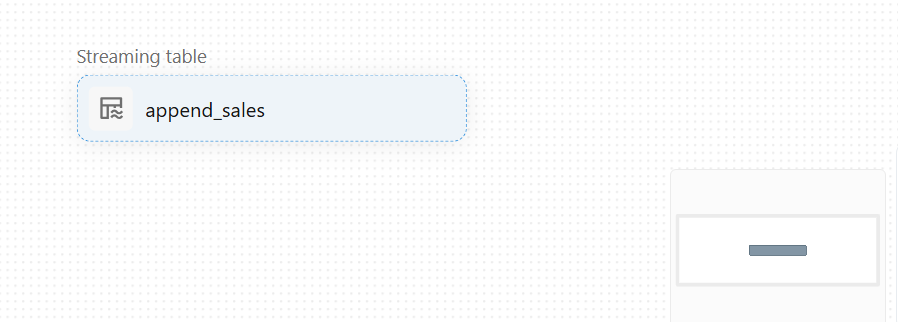

### create another file in bronze

## ingestion_products.py
``` python
import dlt

# Ingesting Products

@dlt.table(
    name="products_stg"
)
def products_stg():
    df=spark.readStream.table("dlt_catalog.dlt_schema.products")
    return df
```

## ingestion_customers.py

```python
import dlt

# Ingesting Customers

@dlt.table(
    name="customers_stg"
)
def customers_stg():
    df=spark.readStream.table("dlt_catalog.dlt_schema.products")
    return df
```

Dry run

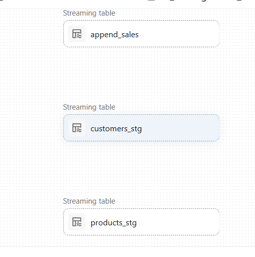


## DLT Expectations
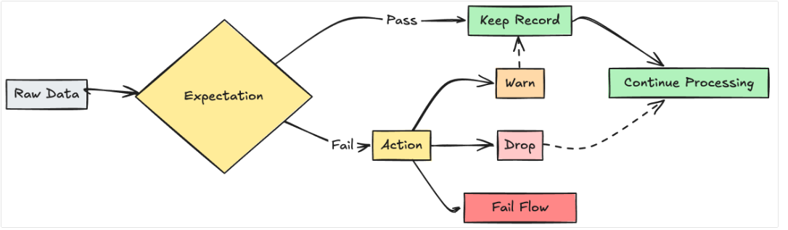
# Delta Live Tables (DLT) Expectations — Short Explanation

Delta Live Tables (DLT) uses **expectations** to enforce data quality rules on incoming raw data.  
Each row in the dataset is validated against these rules, and the outcome determines how DLT handles it.

---

## 🔶 1. Raw Data → Expectation Check
DLT evaluates each row against a rule, for example:
- `age > 0`
- `email IS NOT NULL`
- `order_amount >= 0`

---

## ✅ If the Record PASSES
- The row is **kept**.
- Processing continues normally.

**Flow:**  
**Pass → Keep Record → Continue Processing**

---

## ❌ If the Record FAILS
DLT provides multiple *actions* for failed data:

---

### 🟨 Option 1 — WARN  
- Logs a warning.
- Keeps the row.
- Processing continues.

**Flow:**  
**Fail → Warn → Keep Record → Continue Processing**

---

### 🟥 Option 2 — DROP  
- Removes the bad row.
- Processing continues with clean data only.

**Flow:**  
**Fail → Drop**

---

### ⛔ Option 3 — FAIL FLOW  
- Stops the entire pipeline.
- Used for strict data quality enforcement.

**Flow:**  
**Fail → Fail Flow**

---

## ⭐ Summary Table

| Result | Action | Output |
|--------|--------|---------|
| Pass | Keep | Continue normally |
| Fail | Warn | Keep and continue |
| Fail | Drop | Remove row |
| Fail | Fail Flow | Stop pipeline |

DLT expectations give you flexible control over **how strict or lenient** your data quality rules should be.
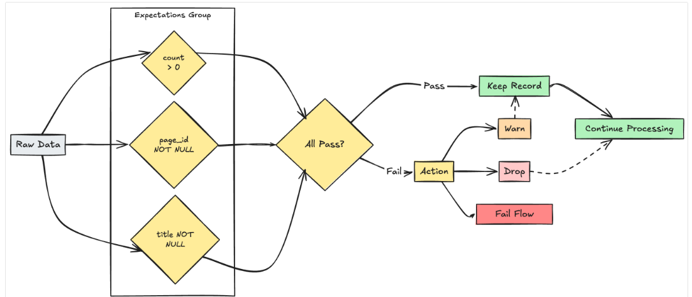

General Example
```python
valid_pages = {"valid_count": "count > 0", "valid_current_page": "current_page_id IS NOT NULL AND current_page_title IS NOT NULL"}

@dp.table
@dp.expect_all(valid_pages)
def raw_data():
  # Create a raw dataset

@dp.table
@dp.expect_all_or_drop(valid_pages)
def prepared_data():
  # Create a cleaned and prepared dataset

@dp.table
@dp.expect_all_or_fail(valid_pages)
def customer_facing_data():
  # Create cleaned and prepared to share the dataset
```


# Let us continue with our demo

## ingestion_products.py
```python
import dlt
# Products Expectations
products_rules={
    "rule_1":"product_id IS NOT NULL",
    "rule_2":"price >=0",
}
# Ingesting Products

@dlt.table(
    name="products_stg"
)
@dlt.expect_all_or_drop(products_rules)
def products_stg():
    df=spark.readStream.table("dlt_catalog.dlt_schema.products")
    return df
```

## ingestion_cutomers.py

```python
import dlt
# Customers Expectations
customers_rules={
    "rule_1":"customer_id IS NOT NULL",
    "rule_2":"customer_name IS NOT NULL",
}    
    
# Ingesting Customers

@dlt.table(
    name="customers_stg"
)
@dlt.expect_all_or_drop(customers_rules)
def customers_stg():
    df=spark.readStream.table("dlt_catalog.dlt_schema.customers")
    return df
```

Dry run

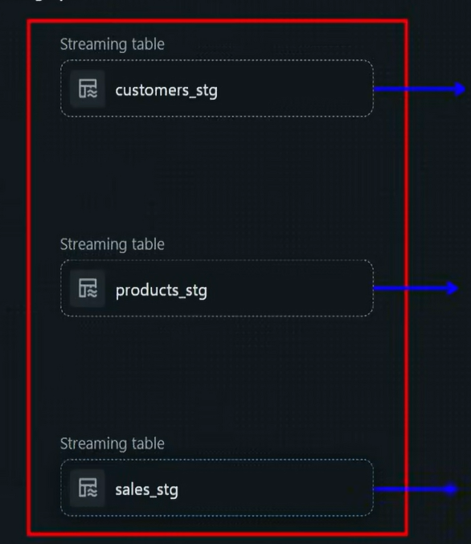
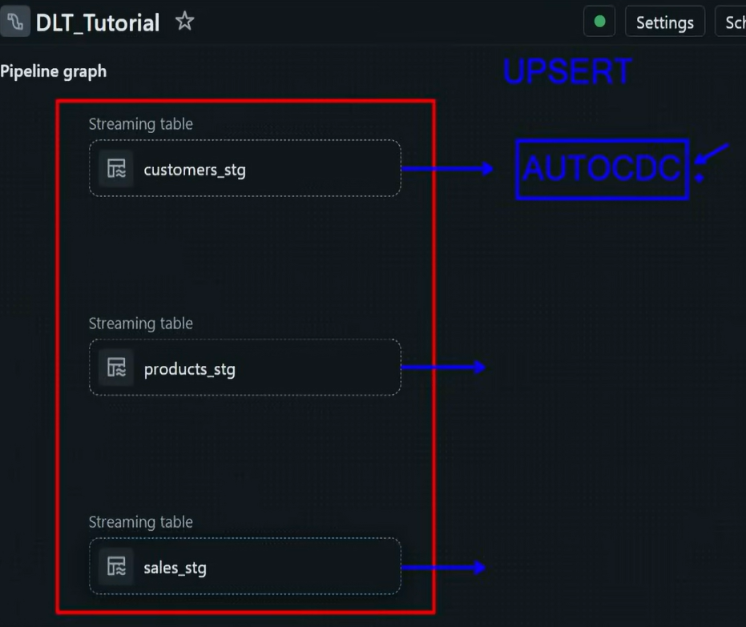
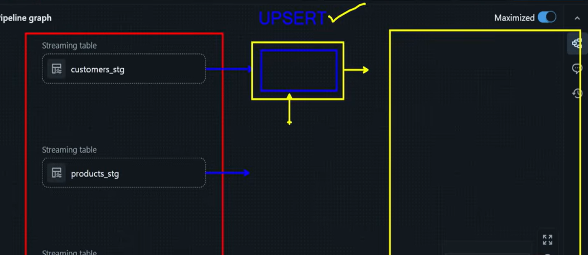

Upsert

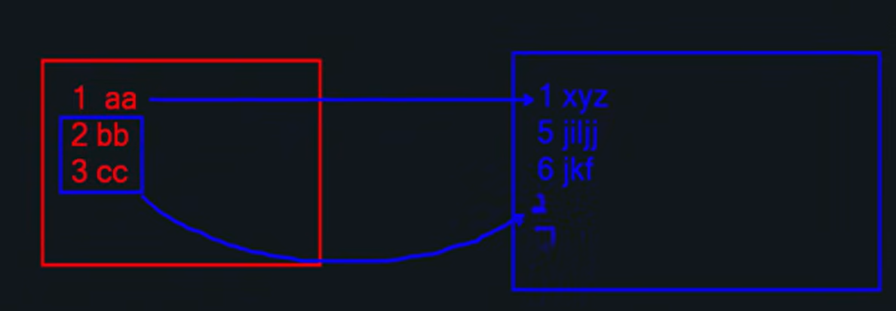

Create new Folder => Silver
Add New File => transform_sales.py


### General  Syntax
```python
from pyspark import pipelines as dp
from pyspark.sql.functions import col, expr

@dp.view
def users():
  return spark.readStream.table("cdc_data.users")

dp.create_streaming_table("target")

dp.create_auto_cdc_flow(
  target = "target",
  source = "users",
  keys = ["userId"],
  sequence_by = col("sequenceNum"),
  apply_as_deletes = expr("operation = 'DELETE'"),
  apply_as_truncates = expr("operation = 'TRUNCATE'"),
  except_column_list = ["operation", "sequenceNum"],
  stored_as_scd_type = 1
)
```

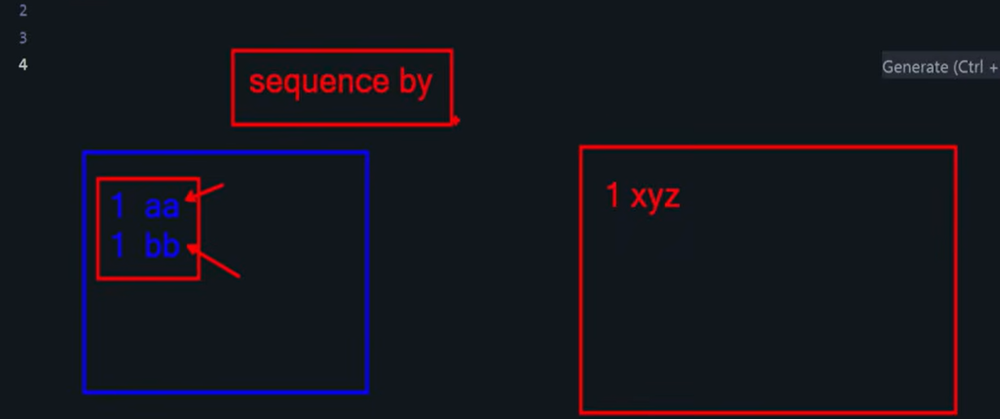
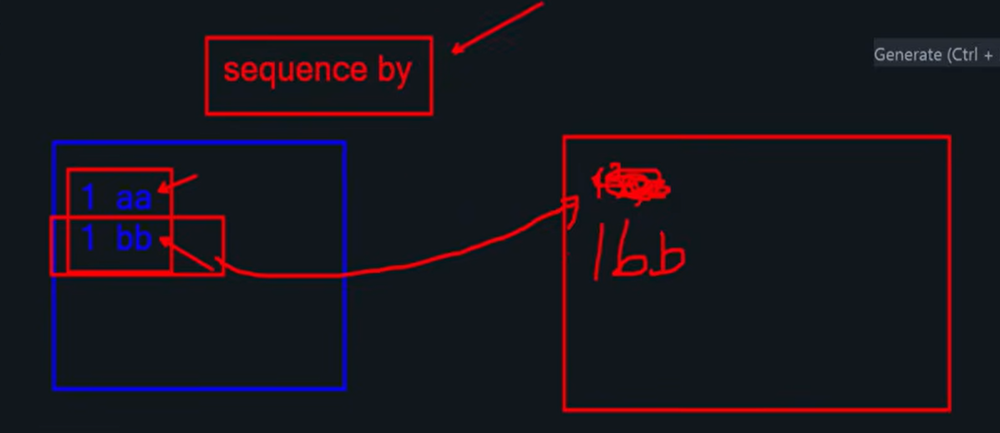
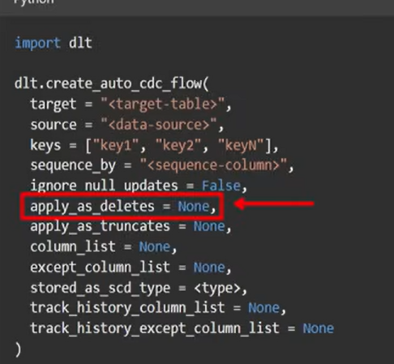
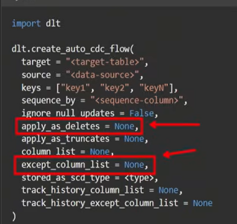


you have 2 options to access the source
1. directly access tables from bronze
2. create view on top of bronze table

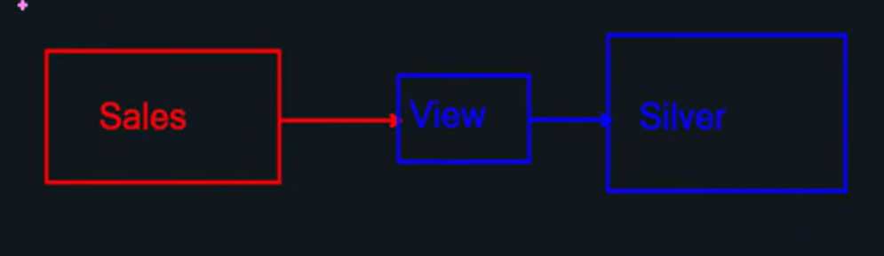

Let us directly work through bronze table

### transform_sales.py
```python
import dlt
from pyspark.sql.functions import *
from pyspark.sql.types import *
#Creating source table
# Transforming Sales Data
@dlt.view(
    name="sales_stg_transform"
)
def sales_stg_transform():
    df=spark.readStream.table("sales_stg")
    df=df.withColumn("total_amount",col("quantity") * col("amount"))
    return df


#Creating Destination silver table
dlt.create_streaming_table(
    name="sales_enr"
)

dlt.create_auto_cdc_flow(
  target = "sales_enr",
  source = "sales_stg_transform",
  keys = ["sales_id"],
  sequence_by = "sale_timestamp",
  apply_as_deletes = None,
  apply_as_truncates = None,
  except_column_list = None,
  stored_as_scd_type = 1,
  track_history_column_list=None,
  track_history_except_column_list=None
)
```

Dry run
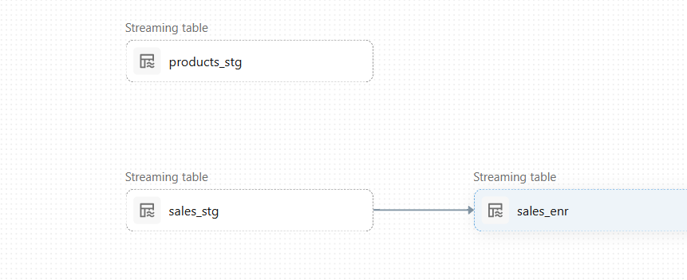

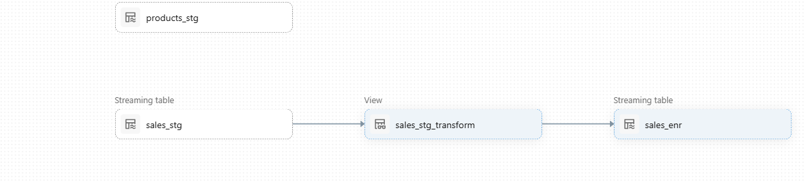

##  Creating Silver View for Gold Layer


View name changed

```python
import dlt
from pyspark.sql.functions import *
from pyspark.sql.types import *
#Creating source table
# Transforming Sales Data
@dlt.view(
    name="sales_enr_view"
)
def sales_stg_transform():
    df=spark.readStream.table("sales_stg")
    df=df.withColumn("total_amount",col("quantity") * col("amount"))
    return df


#Creating Destination silver table
dlt.create_streaming_table(
    name="sales_enr"
)

dlt.create_auto_cdc_flow(
  target = "sales_enr",
  source = "sales_enr_view",
  keys = ["sales_id"],
  sequence_by = "sale_timestamp",
  apply_as_deletes = None,
  apply_as_truncates = None,
  except_column_list = None,
  stored_as_scd_type = 1,
  track_history_column_list=None,
  track_history_except_column_list=None
)

```

Create New File in Silver 
transform_products.py

```python
import dlt
from pyspark.sql.functions import *
from pyspark.sql.types import *
#Creating source table
# Transforming Products Data
@dlt.view(
    name="products_enr_view"
)
def products_stg_transform():
    df=spark.readStream.table("products_stg")
    df=df.withColumn("price",col("price").cast(IntegerType()))
    return df


#Creating Destination silver table
dlt.create_streaming_table(
    name="products_enr"
)

dlt.create_auto_cdc_flow(
  target = "products_enr",
  source = "products_enr_view",
  keys = ["product_id"],
  sequence_by = "last_updated",
  apply_as_deletes = None,
  apply_as_truncates = None,
  except_column_list = None,
  stored_as_scd_type = 1,
  track_history_column_list=None,
  track_history_except_column_list=None
)
```

## transform_customers.py
```python
import dlt
from pyspark.sql.functions import *
from pyspark.sql.types import *
#Creating source table
# Transforming Products Data
@dlt.view(
    name="customers_enr_view"
)
def products_stg_transform():
    df=spark.readStream.table("customers_stg")
    df=df.withColumn("customer_name",upper(col("custoemr_name")))
    return df


#Creating Destination silver table
dlt.create_streaming_table(
    name="customers_enr"
)

dlt.create_auto_cdc_flow(
  target = "customers_enr",
  source = "customers_enr_view",
  keys = ["customer_id"],
  sequence_by = "last_updated",
  apply_as_deletes = None,
  apply_as_truncates = None,
  except_column_list = None,
  stored_as_scd_type = 1,
  track_history_column_list=None,
  track_history_except_column_list=None
)
```


# Slowly changing Dimension


type 3 also there and rarely used


# create Gold Folder

create new File
dim_products.py
```python
import dlt

# Create Empty Streaming Table
dlt.create_streaming_table(
    name="dim_products"
)

dlt.create_auto_cdc_flow(
  target = "dim_products",
  source = "products_enr_view",
  keys = ["product_id"],
  sequence_by = "last_updated",
  apply_as_deletes = None,
  apply_as_truncates = None,
  except_column_list = None,
  stored_as_scd_type = 2,
  track_history_column_list=None,
  track_history_except_column_list=None
)

```

clone dim_products.py  as dim_customers.py
```python
import dlt

# Create Empty Streaming Table
dlt.create_streaming_table(
    name="dim_customers"
)

dlt.create_auto_cdc_flow(
  target = "dim_customers",
  source = "customers_enr_view",
  keys = ["customer_id"],
  sequence_by = "last_updated",
  apply_as_deletes = None,
  apply_as_truncates = None,
  except_column_list = None,
  stored_as_scd_type = 2,
  track_history_column_list=None,
  track_history_except_column_list=None
)

```


clone new file as fact_sales.py
```python
import dlt

# Create Empty Streaming Table
dlt.create_streaming_table(
    name="fact_sales"
)

dlt.create_auto_cdc_flow(
  target = "fact_sales",
  source = "sales_enr_view",
  keys = ["sales_id"],
  sequence_by = "sale_timestamp",
  apply_as_deletes = None,
  apply_as_truncates = None,
  except_column_list = None,
  stored_as_scd_type = 1,
  track_history_column_list=None,
  track_history_except_column_list=None
)

```

create another file 
business_regin_category_sales.py
```python

import dlt
from pyspark.sql.functions import *

# Creating Mat Business view
@dlt.table(
    name="business_sales"    
)

def business_sales():
    df_fact=spark.read.table("fact_sales")
    df_dimCcust=spark.read.table("dim_customers")
    df_dimProd=spark.read.table("dim_products")

    df_join=df_fact.join(df_dimCcust,df_fact.customer_id==df_dimCcust.customer_id,"inner").join(df_dimProd,df_fact.product_id==df_dimProd.product_id,"inner")

    df_prun=df_join.select("region","Category","total_amount")

    df_agg=df_prun.groupBy("region","Category").agg(sum("total_amount").alias("total_amount"))
    return df_agg
```
Dry Run

Run Pipeline


Now let us add incremental data


after inserting all incremental load data from query

Monitor howmany records we have

Re Run Pipeline


Left pane -> Goto -> job or pipelines


