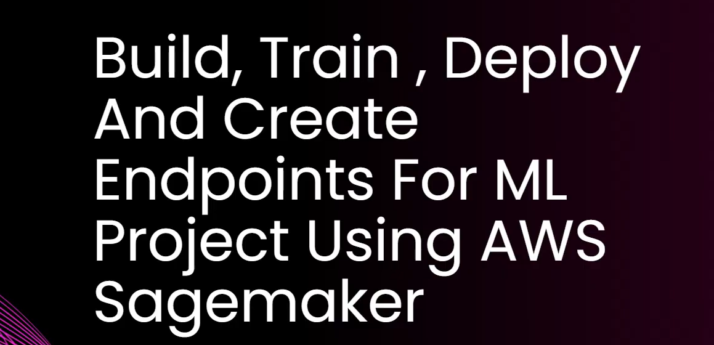
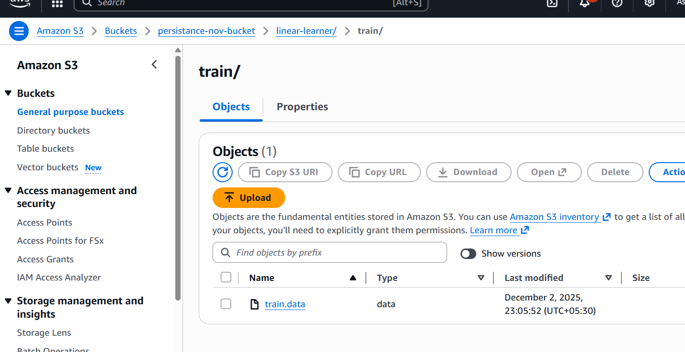
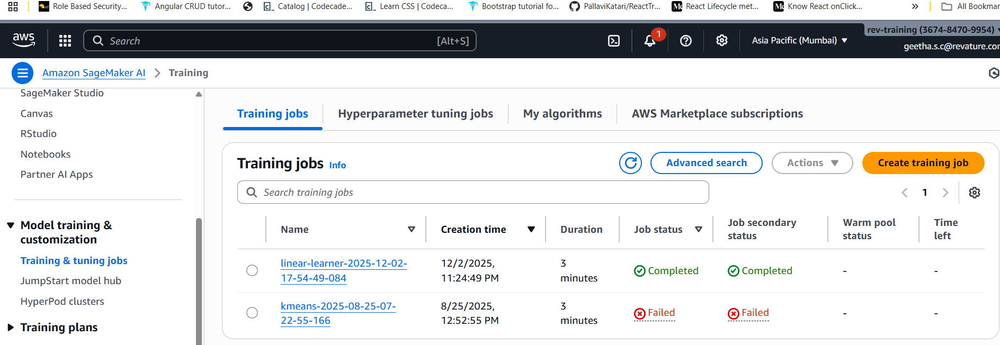
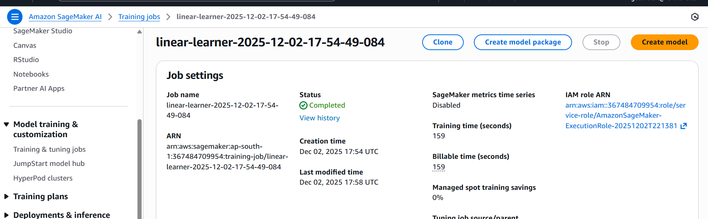
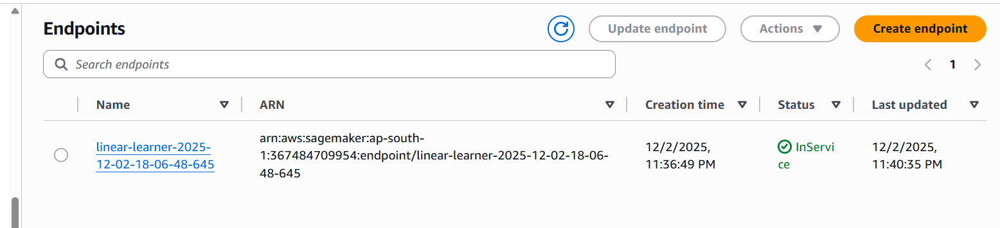

```python

import pandas as pd
import numpy as np
import boto3
from sklearn.model_selection import train_test_split
import sagemaker
from sagemaker import Session
import io
import sagemaker.amazon.common as smac
import os
from sagemaker.amazon.amazon_estimator import get_image_uri

```

```python
df=pd.read_csv("student_scores.csv")
df.head()

df.shape

# Step 1: Separate X and Y
x = df[["Hours"]]
y = df[["Scores"]]


# Step 2: Check data types
print(x.dtypes)
print(y.dtypes)


# Step 3: Convert to float
x = x.astype("float32")
y = y.astype("float32")

y.dtypes


# split the data
X_train, X_test, y_train, y_test = train_test_split(x, y, test_size=0.2)


# reset index
X_train = X_train.reset_index(drop=True)
y_train = y_train.reset_index(drop=True)
X_test = X_test.reset_index(drop=True)
y_test = y_test.reset_index(drop=True)


print(X_train)

# we need to take label column as vector
y_train = y_train.iloc[:,0]

y_test = y_test.iloc[:,0]

print(y_test)


import numpy as np
import boto3
import io
import os
import sagemaker
import sagemaker.amazon.common as smac

# 1. Create session
session = sagemaker.Session()
role = sagemaker.get_execution_role()

bucket_name = "persistance-nov-bucket"
prefix = "linear-learner"

# 2. Convert training arrays
X_train_np = np.array(X_train).astype("float32")
y_train_np = np.array(y_train).astype("float32")

# 3. Write NumPy → protobuf buffer
buf = io.BytesIO()
smac.write_numpy_to_dense_tensor(buf, X_train_np, y_train_np)
buf.seek(0)

# 4. Upload to S3
key = "train.data"
s3_path = os.path.join(prefix, "train", key)

boto3.resource("s3").Bucket(bucket_name).Object(s3_path).upload_fileobj(buf)

s3_train_data = f"s3://{bucket_name}/{s3_path}"
print("Data Uploaded Successfully:", s3_train_data)

# 5. Output location
output_location = f"s3://{bucket_name}/{prefix}/output"
print("Output path:", output_location)

# 6. Retrieve SageMaker Algorithm container
container = sagemaker.image_uris.retrieve(
    "linear-learner",
    boto3.Session().region_name
)

# 7. Define estimator
linear = sagemaker.estimator.Estimator(
    image_uri=container,
    role=role,
    instance_count=1,
    instance_type="ml.m4.xlarge",   # linear learner supports this
    output_path=output_location,
    sagemaker_session=session
)

# 8. Hyperparameters
linear.set_hyperparameters(
    feature_dim=1,
    predictor_type="regressor",
    mini_batch_size=4,
    epochs=6,
    num_models=32,
    loss="absolute_loss"
)

# 9. ⭐ START THE TRAINING (most important)
linear.fit({"train": s3_train_data})

```
run


create s3 bucket

change the policies








```python
#deploy model
# linear_regresor = linear.deploy(initial_instance_count=1, instatnce_type="ml.m4.xlarge")
```

after deploy




```python
linear_regresor.serializer = sagemaker.serializers.CSVserializer()
linear_regresorar.deserializer = sagemaker.deserializers.JSONDeserializer()
```

```python
# prediction
results=linear_regresor.predict(X_test)
```

```python
linear_regresor.delete_endpoint()
```

# final code
```python

import numpy as np
import boto3
import io
import os
import sagemaker
import sagemaker.amazon.common as smac

# Create session and role
session = sagemaker.Session()
role = sagemaker.get_execution_role()

bucket_name = "persistance-nov-bucket"
prefix = "linear-learner"

# Convert training arrays
X_train_np = np.array(X_train).astype("float32")
y_train_np = np.array(y_train).astype("float32")

# Write numpy to protobuf
buf = io.BytesIO()
smac.write_numpy_to_dense_tensor(buf, X_train_np, y_train_np)
buf.seek(0)

# Upload to S3
key = "train.data"
s3_path = os.path.join(prefix, "train", key)
boto3.resource("s3").Bucket(bucket_name).Object(s3_path).upload_fileobj(buf)

s3_train_data = f"s3://{bucket_name}/{s3_path}"
print("Data uploaded successfully:", s3_train_data)

# Output location
output_location = f"s3://{bucket_name}/{prefix}/output"

# Retrieve built-in container
container = sagemaker.image_uris.retrieve(
    "linear-learner",
    session.boto_region_name
)

# Define estimator
linear = sagemaker.estimator.Estimator(
    image_uri=container,
    role=role,
    instance_count=1,
    instance_type="ml.m4.xlarge",
    output_path=output_location,
    sagemaker_session=session
)

# Hyperparameters
linear.set_hyperparameters(
    feature_dim=X_train_np.shape[1],
    predictor_type="regressor",
    mini_batch_size=4,
    epochs=6,
    num_models=32,
    loss="absolute_loss"
)

# Training
linear.fit({"train": s3_train_data})

###############################################################################
# ⭐ CREATE PREDICTOR (THIS WAS MISSING)
###############################################################################

linear_predictor = linear.deploy(
    initial_instance_count=1,
    instance_type="ml.m4.xlarge"
)

linear_predictor.serializer = sagemaker.serializers.CSVSerializer()
linear_predictor.deserializer = sagemaker.deserializers.JSONDeserializer()

###############################################################################
# ⭐ PREDICT
###############################################################################

results = linear_predictor.predict(X_test)
print("Prediction:", results)

###############################################################################
# OPTIONAL: CLEAN UP RESOURCES
###############################################################################

# linear_predictor.delete_endpoint()

```